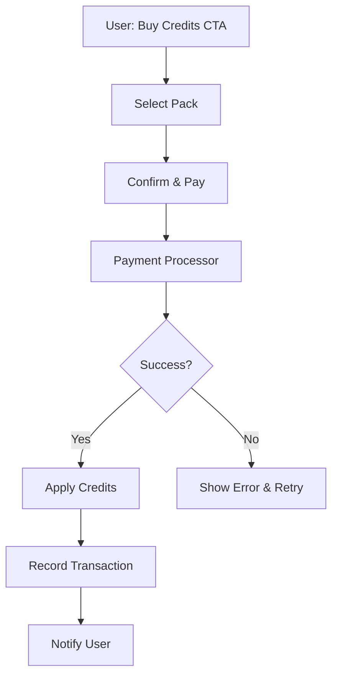

# STRIKE GEN AI — Credit Top-Up System

Version: 0.1

Date: 2026-07-09

Author: STRIKE GEN AI Product Team

---

## 1. Overview

The credit top-up system lets users buy additional credits outside their subscription allotment. This document defines credit packs, the purchase flow, and reconciliation. It is a planning-stage document; prices are illustrative.

See also:
- [AI Pricing & Credit System](ai-pricing-and-credit-system.md) — credit semantics and ledger.
- [Subscription Plans](subscription-plans.md) — included credits.
- [API Specification](api-specification.md) — `/credits/purchase` endpoint.

---

## 2. Credit Packs

Credit packs are fixed bundles offered at a per-credit rate that improves with volume. Packs are currency-agnostic at the planning stage; USD is used as the reference currency.

| Pack | Credits | Price (USD) | Per-Credit | Target |
|---|---|---|---|---|
| Starter | 50 | $5 | $0.10 | Occasional top-up |
| Creator | 200 | $18 | $0.09 | Regular creator |
| Pro | 1,000 | $80 | $0.08 | Frequent creator |
| Bulk | 5,000 | $350 | $0.07 | Agency / high volume |

Notes:
- Pack pricing may vary by region and promotional campaign.
- Enterprise contracts may negotiate custom packs and invoiced billing.

---

## 3. Purchase Flow

Steps:
1. User selects a pack from the billing page or a credit-shortage dialog.
2. System creates a payment intent via the payment processor.
3. User completes checkout (handled by the processor's secure UI).
4. On webhook `payment.succeeded`:
   - Record a `payments` entry.
   - Add credits via a `credit_transactions` entry with `reason = purchase`.
   - Update the user's available balance.
   - Send an in-app and email confirmation.
5. On webhook `payment.failed`:
   - Record the failed payment.
   - Surface the failure to the user with retry options.

---

## 4. Idempotency and Reconciliation

- The purchase endpoint requires an `Idempotency-Key` to prevent double-crediting on retry.
- Webhook handlers deduplicate on the processor's event ID.
- A nightly reconciliation job compares processor records against `payments` and `credit_transactions`; discrepancies are flagged for finance review.

---

## 5. Refunds

- Refunds are issued by admins with the finance role.
- On refund, a compensating `credit_transactions` entry with negative `change_amount` and `reason = refund` is recorded.
- If the user has already spent the credits, the balance may go negative and be recovered on future allocations; this is policy and configurable.

---

## 6. Expiry

- Purchased credits do not expire by default.
- Promotional credits (free grants, campaign giveaways) expire per the campaign rules and are tracked separately from purchased credits.

---

## 7. Future Considerations

- **Auto top-up** — automatically buy a configured pack when balance drops below a threshold.
- **Gift credits** — transfer credits between users (with fraud controls).
- **Enterprise invoiced packs** — purchase via invoice with net-terms billing.

---

## Revision History

- 0.1 — Initial credit top-up system (2026-07-09)
