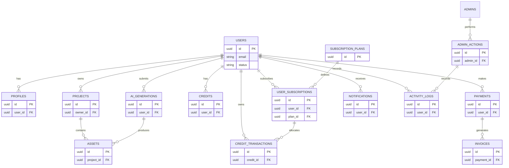

# STRIKE GEN AI — Database Design (Planning Document)

Version: 0.1

Date: 2026-07-09

Author: STRIKE GEN AI Data & Architecture Team

---

## 1. Database Overview

This document provides a technology-agnostic, planning-stage database design for STRIKE GEN AI. It defines logical entities, relationships, data validation rules, indexing guidance, backup and recovery considerations, retention policies, security and privacy considerations, and scalability strategies. The goal is to provide a clear blueprint that can be translated into a physical schema during the implementation phase.

Scope:
- Logical data model covering users, profiles, projects, assets, AI generations, credits, subscriptions, payments, notifications, and administrative audit trails.
- Data dictionary for core entities with primary/foreign keys and important attributes.
- ER diagram and relationship descriptions.

Out of scope:
- No SQL DDL, vendor-specific features, or implementation-level configuration is provided in this document.

---

## 2. Design Principles

- Single source of truth: Maintain canonical records for users, projects, assets, and billing entities.
- Normalization: Use logical normalization to avoid data anomalies while allowing denormalization where performance requires it.
- Auditability: Preserve immutable audit logs for billing, credits, and admin actions.
- Tenant awareness: Design for multi-tenant (per-user or per-organization) partitioning and strong ownership of records.
- Immutable job records: Generation jobs and credit transactions should be append-only with references for safe reconciliation.
- Privacy by design: Minimize PII and support user data export/deletion requests.
- Replaceability: Keep service-specific metadata (e.g., external AI provider response) in a flexible JSON field to avoid frequent schema changes.

---

## 3. Entity Relationship Overview

Below is a high-level ER view describing core entities and primary relationships. The diagram uses conceptual entity boxes and arrows to show cardinality (1:1, 1:N, N:1).

Mermaid — ER Diagram (conceptual)

Notes:
- The ER diagram above is conceptual; refer to the Core Entities section for detailed attributes and keys.

---

## 4. Core Entities

The following subsections include a data dictionary for each core entity: primary key (PK), foreign keys (FK), important attributes, and a brief description.

For attribute types we use conceptual types (UUID, string, text, integer, decimal, boolean, timestamp, JSON).

### 4.1 Users

Description: Canonical account record for every individual or service that interacts with the platform.

Data dictionary:
- Table name: users
- Primary key: id (UUID)
- Important attributes:
  - id (UUID, PK) — unique user identifier
  - email (string, unique, indexed) — primary contact and login identifier
  - email_verified (boolean)
  - password_hash (string) — hashed credential (sensitive)
  - status (enum: active, suspended, pending, deleted)
  - created_at (timestamp)
  - updated_at (timestamp)
  - tenant_id (UUID, nullable) — for future multi-organization support
  - metadata (JSON) — extensible profile-level metadata

Notes:
- Email must be unique. Users may later be associated with organizations/teams.

### 4.2 Profiles

Description: User profile and display preferences separated from authentication data.

Data dictionary:
- Table name: profiles
- PK: id (UUID)
- FKs: user_id (UUID) -> users.id
- Important attributes:
  - id (UUID, PK)
  - user_id (UUID, FK, indexed)
  - display_name (string)
  - avatar_url (string)
  - bio (text)
  - language (string)
  - timezone (string)
  - preferences (JSON)
  - created_at, updated_at

Notes:
- Splitting profiles keeps authentication-focused users table minimal and simplifies data export/deletion.

### 4.3 Projects

Description: Logical grouping of assets and generations owned by a user (or team in future).

Data dictionary:
- Table name: projects
- PK: id (UUID)
- FKs: owner_id (UUID) -> users.id
- Important attributes:
  - id (UUID, PK)
  - owner_id (UUID, FK, indexed)
  - title (string)
  - description (text)
  - visibility (enum: private, public, organization)
  - created_at, updated_at
  - metadata (JSON)

Notes:
- Projects are owned by a user; future expansion may add organization/team ownership and role assignments.

### 4.4 Assets

Description: Media files (video, image, audio) produced or uploaded by users.

Data dictionary:
- Table name: assets
- PK: id (UUID)
- FKs: project_id (UUID) -> projects.id, owner_id (UUID) -> users.id, generation_id (UUID) -> ai_generations.id (nullable)
- Important attributes:
  - id (UUID, PK)
  - owner_id (UUID, FK, indexed)
  - project_id (UUID, FK, indexed, nullable)
  - generation_id (UUID, FK, nullable)
  - kind (enum: video, image, audio, other)
  - storage_path / url (string)
  - mime_type (string)
  - filesize_bytes (integer)
  - width (integer, nullable)
  - height (integer, nullable)
  - duration_seconds (decimal, nullable)
  - status (enum: available, archived, deleted)
  - metadata (JSON) — provider responses, thumbnails, transcode refs
  - created_at, updated_at

Notes:
- Asset storage is separate from metadata; storage_path is a reference to actual object storage or CDN.

### 4.5 AI Generations

Description: Records representing a single generation request and lifecycle.

Data dictionary:
- Table name: ai_generations
- PK: id (UUID)
- FKs: user_id (UUID) -> users.id, project_id (UUID, nullable) -> projects.id
- Important attributes:
  - id (UUID, PK)
  - user_id (UUID, FK, indexed)
  - project_id (UUID, FK, indexed, nullable)
  - prompt (text)
  - parameters (JSON) — style, duration, resolution, provider hints
  - estimated_cost_credits (decimal)
  - actual_cost_credits (decimal, nullable)
  - status (enum: queued, processing, completed, failed, cancelled)
  - provider (string) — identifier for the AI provider used
  - provider_job_id (string, nullable)
  - provider_response (JSON, nullable)
  - result_assets (JSON) — array of asset refs or ids
  - error_message (text, nullable)
  - created_at, updated_at, completed_at (timestamp nullable)

Notes:
- Generations must be append-only for auditability; status changes recorded with timestamps.

### 4.6 Credits

Description: Ledger of credit allocations and balances for a user or subscription.

Data dictionary:
- Table name: credits
- PK: id (UUID)
- FKs: user_id (UUID) -> users.id, subscription_id (UUID, nullable) -> user_subscriptions.id
- Important attributes:
  - id (UUID, PK)
  - user_id (UUID, FK, indexed)
  - balance (decimal) — current balance (derived field may be acceptable but ledger recommended)
  - allocated_at (timestamp)
  - expires_at (timestamp, nullable)
  - source (enum: subscription, purchase, admin_adjustment, promo)
  - metadata (JSON)
  - created_at, updated_at

Notes:
- Prefer using a credit transaction ledger for all changes to avoid race conditions and support reconciliation.

### 4.7 Credit Transactions

Description: Immutable ledger entries representing credit movements (debits/credits).

Data dictionary:
- Table name: credit_transactions
- PK: id (UUID)
- FKs: credit_id (UUID) -> credits.id, generation_id (UUID, nullable) -> ai_generations.id, user_id (UUID) -> users.id
- Important attributes:
  - id (UUID, PK)
  - credit_id (UUID, FK, indexed)
  - user_id (UUID, FK, indexed)
  - generation_id (UUID, FK, nullable)
  - change_amount (decimal) — positive for credit, negative for deduction
  - resulting_balance (decimal)
  - reason (enum: generation, purchase, refund, admin_adjustment)
  - reference (string) — external payment id or invoice id
  - created_at (timestamp)

Notes:
- This table is append-only and the source of truth for reconciliation.

### 4.8 Subscription Plans

Description: Catalog of available subscription plans and entitlements.

Data dictionary:
- Table name: subscription_plans
- PK: id (UUID)
- Important attributes:
  - id (UUID, PK)
  - plan_key (string, unique) — human-friendly and programmatic identifier
  - name (string)
  - description (text)
  - included_credits (decimal)
  - price_amount (decimal)
  - price_currency (string)
  - billing_interval (enum: monthly, yearly)
  - entitlements (JSON) — feature flags per plan
  - created_at, updated_at

Notes:
- Plans are immutable once published; changes can create new plan versions.

### 4.9 User Subscriptions

Description: Active subscriptions per user with lifecycle and billing metadata.

Data dictionary:
- Table name: user_subscriptions
- PK: id (UUID)
- FKs: user_id (UUID) -> users.id, plan_id (UUID) -> subscription_plans.id
- Important attributes:
  - id (UUID, PK)
  - user_id (UUID, FK, indexed)
  - plan_id (UUID, FK)
  - status (enum: active, past_due, cancelled, trialing)
  - current_period_start (timestamp)
  - current_period_end (timestamp)
  - next_billing_at (timestamp)
  - billing_metadata (JSON)
  - external_subscription_id (string) — id from payment provider
  - created_at, updated_at

Notes:
- Support for trial and promotional statuses required.

### 4.10 Payments

Description: Records of payment attempts and outcomes.

Data dictionary:
- Table name: payments
- PK: id (UUID)
- FKs: user_id (UUID) -> users.id, subscription_id (UUID, nullable) -> user_subscriptions.id
- Important attributes:
  - id (UUID, PK)
  - user_id (UUID, FK, indexed)
  - amount (decimal)
  - currency (string)
  - status (enum: succeeded, failed, pending, refunded)
  - provider (string)
  - provider_payment_id (string)
  - raw_response (JSON)
  - created_at, updated_at

Notes:
- Raw provider responses can be stored in JSON for reconciliation; restrict retention according to privacy.

### 4.11 Invoices

Description: Billing documents associated with payments and subscriptions.

Data dictionary:
- Table name: invoices
- PK: id (UUID)
- FKs: payment_id (UUID) -> payments.id, user_id (UUID) -> users.id
- Important attributes:
  - id (UUID, PK)
  - user_id (UUID, FK)
  - payment_id (UUID, FK, nullable)
  - invoice_number (string, unique)
  - line_items (JSON)
  - total_amount (decimal)
  - currency (string)
  - status (enum: issued, paid, voided)
  - issued_at, paid_at

Notes:
- Invoice generation may be delegated to billing systems; the DB stores canonical invoice metadata for lookup.

### 4.12 Notifications

Description: User-facing notifications for generation completion, billing, warnings, and announcements.

Data dictionary:
- Table name: notifications
- PK: id (UUID)
- FKs: user_id (UUID) -> users.id, generation_id (UUID, nullable) -> ai_generations.id
- Important attributes:
  - id (UUID, PK)
  - user_id (UUID, FK, indexed)
  - type (enum: generation_completed, billing_reminder, credit_low, announcement)
  - channel (enum: in_app, email, webhook)
  - payload (JSON) — templated data
  - status (enum: pending, sent, failed, dismissed)
  - sent_at (timestamp, nullable)
  - created_at

Notes:
- Notifications should support retry metadata and correlation to job ids.

### 4.13 Activity Logs

Description: High-volume event logs for user actions and system events (read-only for analytics/replay).

Data dictionary:
- Table name: activity_logs
- PK: id (UUID)
- FKs: user_id (UUID, nullable) -> users.id
- Important attributes:
  - id (UUID, PK)
  - user_id (UUID, FK, nullable)
  - event_type (string)
  - event_payload (JSON)
  - ip_address (string, nullable)
  - user_agent (string, nullable)
  - created_at (timestamp)

Notes:
- Activity logs can be partitioned by date and may be offloaded to analytics stores; retention rules apply.

### 4.14 Admin Actions

Description: Audit records for privileged administrative activities (manually adjusting credits, refunds, content takedowns).

Data dictionary:
- Table name: admin_actions
- PK: id (UUID)
- FKs: admin_id (UUID) -> users.id, target_user_id (UUID, nullable) -> users.id
- Important attributes:
  - id (UUID, PK)
  - admin_id (UUID, FK)
  - action_type (string)
  - target (JSON) — what was changed (credit, subscription, asset)
  - reason (text)
  - metadata (JSON)
  - created_at (timestamp)

Notes:
- Admin actions provide an auditable trail and must be immutable.

---

## 5. Relationships Between Entities

Key relationships and cardinality:
- users 1 — N profiles: one user may have one profile (profile table separated for future extension).
- users 1 — N projects: a user can own many projects.
- projects 1 — N assets: projects contain many assets.
- users 1 — N ai_generations: users submit many generation jobs.
- ai_generations 1 — N assets: a generation may produce multiple assets.
- users 1 — N credits: a user may have many credit allocations over time (e.g., monthly grants).
- credits 1 — N credit_transactions: each credit allocation has many transactions for debits/credits.
- subscription_plans 1 — N user_subscriptions: plans define many subscriptions.
- user_subscriptions 1 — N credit_transactions: renewals allocate credits, creating transactions.
- users 1 — N payments: users make multiple payments.
- payments 1 — 1 invoices (or 1 — N depending on business rules): a payment may cover multiple invoices or vice versa.

Referential integrity rules:
- Cascade deletes should be avoided for user deletion; prefer soft-delete flags and anonymization workflows to preserve audit records.
- When assets are deleted, keep a tombstone record (soft delete) for audit and possible restore.
- Credit transactions are append-only and must not be deleted; corrections should be recorded as compensating transactions.

---

## 6. Data Validation Rules

High-level validation rules to ensure data integrity:
- Email format validation and uniqueness for users.
- Non-nullable foreign keys for ownership relationships (user_id for projects, generations) except where explicitly nullable (e.g., anonymous uploads in the future).
- Enums constrained to documented values (status, kind, plan types).
- Monetary and credit fields: use decimal with a defined precision; do not use floating point for currency or credits.
- JSON fields: validate schema at application layer before persisting; store raw provider responses in dedicated JSON fields with size limits.
- Timestamps: use UTC and record created_at and updated_at for all mutable entities.

---

## 7. Indexing Strategy

Indexing guidance to support common queries and ensure performance while balancing write cost.

Recommended indexes (logical):
- Primary key indexes: id (PK) on all tables.
- Users: index on email (unique), status, tenant_id.
- Profiles: index on user_id.
- Projects: index on owner_id, visibility.
- Assets: index on owner_id, project_id, status, kind; consider composite index (owner_id, created_at) for listing recent assets.
- AI Generations: index on user_id, status, provider_job_id; composite index (user_id, created_at) for history queries.
- Credits: index on user_id, expires_at.
- Credit Transactions: index on credit_id, user_id, generation_id, created_at; consider clustered ordering by created_at for append-only ledger.
- User Subscriptions: index on user_id, status, next_billing_at.
- Payments and Invoices: index on user_id, provider_payment_id, status, created_at.
- Notifications: index on user_id, status, created_at for query and cleanup.
- Activity Logs: partition by date and index on user_id and event_type for analytics queries.

Indexing trade-offs:
- Balance read vs write; high write tables (activity_logs, credit_transactions) should favor append-friendly indexing and partitioning.
- Use partial or filtered indexes for frequently queried subsets (e.g., active subscriptions) if supported by the chosen database.

---

## 8. Backup and Recovery Strategy

Guiding principles:
- Regular, automated backups of critical relational metadata (users, billing, credits, generations, assets metadata).
- Snapshots for large data stores where applicable; incremental backups to reduce RPO/RTO.
- Recovery objectives: define Recovery Time Objective (RTO) and Recovery Point Objective (RPO) suitable for business requirements (e.g., RTO hours, RPO minutes/hours depending on SLA).
- Test restores: periodic restore drills to verify backups can be used for recovery.
- Offsite retention: keep backups in a separate trust boundary to protect against regional failures.

Asset storage considerations:
- Media assets stored in object storage with versioning/immutable storage options for critical content.
- Consider separate backup/archival policies for cold vs hot assets.

---

## 9. Data Retention Policy

Recommended baseline retention policies (configurable per law and product needs):
- Activity Logs: retain 90 days in primary DB, longer in analytics archive (1-3 years) depending on compliance.
- Credit Transactions, Payments, Invoices: retain for at least 7 years for financial auditability (subject to regional regulations).
- AI Generations and Assets: default 1–3 years in hot storage; archival or deletion options for older assets (user-configurable or per plan).
- User accounts: upon deletion request, anonymize or purge PII within a defined window (e.g., 30–90 days) while keeping minimal audit trails as required by law.

Policy considerations:
- Provide opt-in/opt-out and user controls for asset retention when possible.
- Ensure retention policies are auditable and enforceable by automated lifecycle processes.

---

## 10. Security and Privacy Considerations

High-level measures:
- Data minimization: store only required PII and allow export/deletion per privacy law.
- Encryption: encrypt PII and sensitive fields at rest; enforce encryption for backups and object storage.
- Access controls: principle of least privilege for DB access; separate roles for application, reporting, analytics, and admin.
- Auditing: immutable logs for admin actions, credit adjustments, refunds, and permission changes.
- Secure secrets: do not store provider credentials in the schema; rely on secrets management for runtime access.
- Masking and redaction: mask sensitive provider responses in logs and UI; restrict access to raw provider_response fields.
- Data residency: design metadata to include region/copy tags to support data residency/legal requirements.

Privacy features:
- Support subject access requests (data export) and the right to be forgotten (anonymization workflows) while preserving required financial audit trails.

---

## 11. Scalability Considerations

Strategies to scale data layer as usage grows:
- Partitioning and sharding: partition large append-only tables (activity_logs, credit_transactions) by time or tenant to limit per-partition size.
- Read replicas: use read replicas for reporting and heavy read workloads (dashboards, analytics) to offload primary writes.
- Denormalization & materialized views: create materialized views or cached aggregates for frequent summary queries (user credit balances, project summaries).
- Archive cold data: move older assets and logs to lower-cost archives and maintain pointers in master metadata tables.
- Event-driven architecture: use event streams (change data capture, event bus) to feed analytics and asynchronous processing.

---

## 12. Future Database Expansion

Potential future additions to the data model:
- Organizations and Teams: add organization table, team memberships, and scoped permissions.
- Template marketplace: marketplace entities (templates, listings, purchases) and review/ratings.
- Multi-region replication: explicit region tags for multi-region failover and data residency.
- API keys and external integrations table for partner access and throttling.
- Fine-grained role and permission tables for per-resource ACLs.

---

Revision History

- 0.1 — Initial planning-stage database design (2026-07-09)
