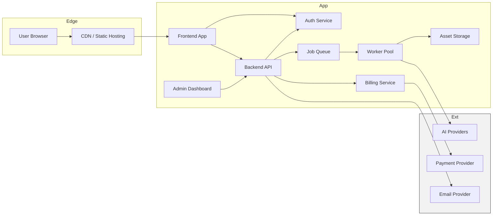
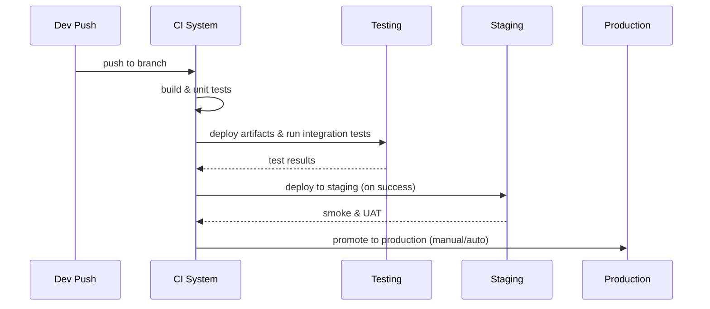
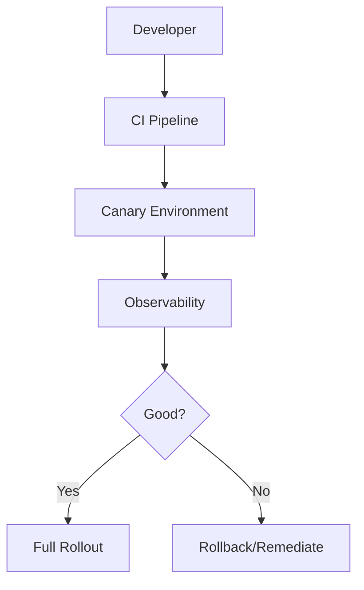

# STRIKE GEN AI — Deployment Strategy (Planning Document)

Version: 0.1

Date: 2026-07-09

Author: STRIKE GEN AI Operations Team

---

This planning-stage Deployment Strategy document outlines high-level approaches and guidance for deploying STRIKE GEN AI. It is intentionally technology-agnostic and avoids provider-specific or implementation-level instructions. The goal is to document environment definitions, CI/CD strategies, release and rollback plans, migration approaches, and operational responsibilities to guide later implementation.

---

## 1. Deployment Overview

This document describes how STRIKE GEN AI will be deployed across multiple environments, how releases will be delivered, and the operational practices required to maintain availability, reliability, and security. It covers deployment environments, infrastructure components, CI/CD and release flows, rollback and migration strategies, backup and recovery, observability, and operational responsibilities.

---

## 2. Deployment Goals

- Safe, repeatable, and auditable deployments across environments.
- Rapid release cadence for features while minimizing user impact.
- Strong roll-back and mitigation strategies for release failures.
- High availability and resilience for core user flows (authentication, generation orchestration, billing).
- Clear separation between development, testing, staging, and production.
- Observability and monitoring integrated into the deployment pipeline.

---

## 3. Environments

Define standard environments with intended use and guardrails.

### Local Development
- Purpose: Developer productivity, feature development, and unit-level testing.
- Scope: Runs trimmed-down services and mocks for third-party integrations. No production data.
- Access: Developers with appropriate credentials.

### Testing (CI)
- Purpose: Automated integration, API, and E2E tests triggered by CI pipelines.
- Scope: Repeatable environment created by CI for test runs; may use ephemeral resources.
- Guardrails: Use synthetic or scrubbed test data; no real payment processing.

### Staging
- Purpose: Pre-production validation and stakeholder acceptance testing (UAT).
- Scope: Full integration with non-production versions of external services (or sandbox modes), representative configuration and scale tests.
- Guardrails: Production-like data sets (anonymized), feature flags to control behaviour.

### Production
- Purpose: Live customer-facing environment.
- Scope: High availability configuration, production traffic, full integrations to payment and AI providers.
- Guardrails: Strict access control, audit logging, limited feature rollout via flags.

---

## 4. Infrastructure Overview

High-level infrastructure components (planning-stage):
- Frontend surfaces (static landing site, single-page application for dashboard and admin UI) served via CDN or static hosting.
- Backend API / orchestration layer exposing REST endpoints and webhooks.
- Worker pools for AI generation orchestration and background processing.
- Job queue and message bus for asynchronous workflows.
- Object storage for media assets and CDN for media delivery.
- Credit management and billing subsystem integrated with payment providers.
- Authentication and identity provider (token service).
- Observability stack (metrics, traces, logs) and alerting.
- Backup storage and disaster recovery artifacts.

Mermaid — Deployment Architecture

Notes:
- Components are logical; implementation choices (cloud, orchestration, containerization) are determined in later stages.

---

## 5. Application Components

List of deployable components and responsibilities:
- Landing Website (static assets) — marketing pages and sign-up.
- Frontend Application — creator dashboard and admin UI (bundled assets, feature flags support).
- Backend API / Orchestration — handles authentication, job submission, credit checks, and orchestration.
- Worker Service(s) — background workers for AI generation, post-processing, and ingestion.
- Job Queue — durable queue for job dispatch and decoupling.
- Asset Storage & CDN — persistent object storage and fast delivery.
- Billing Service — subscription lifecycle and payment reconciliation.
- Notification Service — email/in-app/webhook delivery.
- Monitoring & Observability — metrics, traces, logs and dashboards.

Each component should be deployable independently and versioned.

---

## 6. CI/CD Strategy

Principles:
- Automate build, test, and deployment pipelines for repeatability and speed.
- Keep build artifacts immutable and versioned.
- Gate deployments to higher environments by automated tests and approvals.

Pipeline stages (logical):
1. Build: Compile and bundle frontend and backend artifacts; produce versioned artifacts.
2. Unit Tests: Run unit and static checks (lint, SAST) on code and configuration.
3. Integration Tests: Run service-level tests with mocked or test integrations.
4. Package: Produce deployable artifacts (containers, static bundles, release manifests).
5. Deploy to Testing: Deploy to CI ephemeral or testing environment and run E2E tests.
6. Deploy to Staging: After passing CI, promote artifacts to staging for UAT and smoke tests.
7. Promote to Production: Manual or semi-automated promotion with required approvals and canary/deployment gates.

Mermaid — CI/CD Pipeline

Testing and gating:
- Automated tests are required before promotion. Staging requires a combination of automated smoke tests and manual UAT signoff for major releases.
- Use feature flags to control new feature exposure in production.

---

## 7. Release Strategy

Recommended release approaches:
- Canary Releases: Deploy new version to a small subset of instances/users, monitor metrics and errors before rolling out fully.
- Blue-Green Deployments: Prepare a parallel environment with the new version and switch traffic after validation to reduce downtime.
- Rolling Updates: Gradual instance-by-instance upgrades with health checks.

Release cadence and approvals:
- Frequent small releases encouraged (CI-driven), with major releases requiring change review and staging UAT.
- All production releases require a checklist including database migration plan, monitoring/alert readiness, and rollback plan.

Mermaid — Release Flow

---

## 8. Rollback Strategy

Principles:
- Plan for safe rollbacks with minimal data loss.
- Prefer backward-compatible changes; avoid destructive schema changes in the same release.

Rollback mechanisms:
- Application rollback: redeploy previous artifact version to instances.
- Database rollback: prefer migrations that are reversible; use compensating migrations when needed.
- Feature flagging: disable new features quickly when unexpected behaviour is detected.

Rollback triggers and guardrails:
- Define clear metrics and thresholds that trigger automated rollback (error rate, latency, job failures, payment errors).
- Maintain a runbook that lists immediate actions, stakeholders to notify, and rollback commands (non-provider specific).

---

## 9. Database Migration Strategy

Guiding rules:
- Migrations must be backwards-compatible during deployment (expand-contract pattern):
  1. Additive changes (add columns, new tables) in a first deploy.
  2. Deploy application version that writes and reads using the new schema.
  3. Migrate or backfill data if needed.
  4. Remove deprecated fields in a later release after verification.

Migration process:
- Version-controlled migration scripts with review and testing in CI and staging.
- Run migrations during maintenance windows if they may impact performance; prefer online migrations.
- For expensive migrations, use rolling or batched approaches and monitor progress.

Schema change approvals:
- Major schema changes require migration plan, estimated windows, and rollback plan approved by DBAs or SREs.

---

## 10. Backup & Recovery

Backup strategy:
- Regular backups of relational metadata (users, billing, credits, generations) with retention policies aligned to compliance.
- Snapshot or versioning for object storage; replicate critical assets where necessary.
- Offsite, encrypted backups for disaster recovery.

Recovery strategy:
- Define RTO and RPO for each data class (e.g., payments, credit ledger, assets).
- Document and test restore procedures regularly.
- Maintain a chain of custody and verification steps after restore to ensure data integrity.

---

## 11. Monitoring & Observability

Key observability aspects:
- Metrics: track request rates, error rates, latency, queue depth, worker throughput, generation completion rates, payment success/failure.
- Tracing: distributed traces for user request flows and generation pipelines.
- Logging: structured logs with correlation ids and redaction of PII.
- Alerts: threshold-based alerts for operational and business-critical metrics.

Integration into deployment:
- Health checks must be present for services; pipelines use health checks to validate deployments.
- Canary deployments must feed metrics into monitoring for evaluation.

---

## 12. Logging Strategy

- Centralized, structured logging for API, workers, and background processes.
- Include correlation IDs (request_id, job_id, user_id) for traceability.
- Redact or mask sensitive fields in logs (PII, tokens, card fragments).
- Log retention policies aligned with compliance and storage cost considerations; archive older logs.

---

## 13. Scaling Strategy

Scaling layers:
- Horizontal scaling for stateless services (API, frontend) behind load balancers.
- Worker pool autoscaling driven by job queue depth and target processing SLAs.
- Read replicas or caches for read-heavy workloads (dashboards, analytics).
- Storage tiering for assets: hot (frequently accessed), warm, and cold (archival) tiers.

Autoscaling considerations:
- Use autoscaling policies based on business metrics (active generation jobs), not just CPU.
- Throttle or backpressure generation submission if external AI providers reach capacity or rate limits.

---

## 14. High Availability

Approaches:
- Redundant instances across availability domains/regions (where required) for critical components.
- Stateless services and externalized state (databases, object storage) to facilitate failover.
- Health checks and automatic instance replacement for degraded components.
- Use of durable queues and retry mechanisms to survive transient failures.

---

## 15. Disaster Recovery

- Define disaster scenarios and RTO/RPO for each.
- Maintain documented playbooks for regional failures, data corruption, and large-scale outages.
- Practice disaster recovery drills periodically and improve the process based on lessons learned.
- Ensure backups and configuration artifacts are stored in an independent trust boundary.

---

## 16. Maintenance Procedures

Planned maintenance activities:
- Scheduled OS and dependency patching during maintenance windows.
- Database vacuuming, compaction, and routine health operations.
- Regular certificate rotation and secrets audits.
- Maintenance notifications to users and admins with scheduled windows.

Maintenance governance:
- Communicate and publish maintenance windows and impact to stakeholders.
- Provide rollback & recovery plan for each maintenance event.

---

## 17. Operational Responsibilities

Suggested responsibilities and roles:
- Engineering: implement features, test migrations, and produce deployment artifacts.
- SRE/Operations: own CI/CD pipelines, scaling, monitoring, and incident response orchestration.
- Security: enforce security gates, manage secret lifecycles, and conduct audits.
- Finance/Business: approve billing changes and review payment-related incident impacts.
- Support: first-line user contact and triage for customer issues.

Access controls:
- Use least-privilege access for operational tools; require approvals for production changes.

---

## 18. Future Infrastructure Evolution

Planned evolution:
- Multi-region deployments for reduced latency and resilience for enterprise customers.
- Managed orchestration and service mesh for more granular traffic control and observability.
- Infrastructure as Code (IaC) to version and review infrastructure changes.
- Progressive migration to region-aware storage and CDNs for global distribution.
- Integration of cost-aware autoscaling and workload placement optimizations.

---

Revision History

- 0.1 — Initial planning-stage deployment strategy (2026-07-09)
