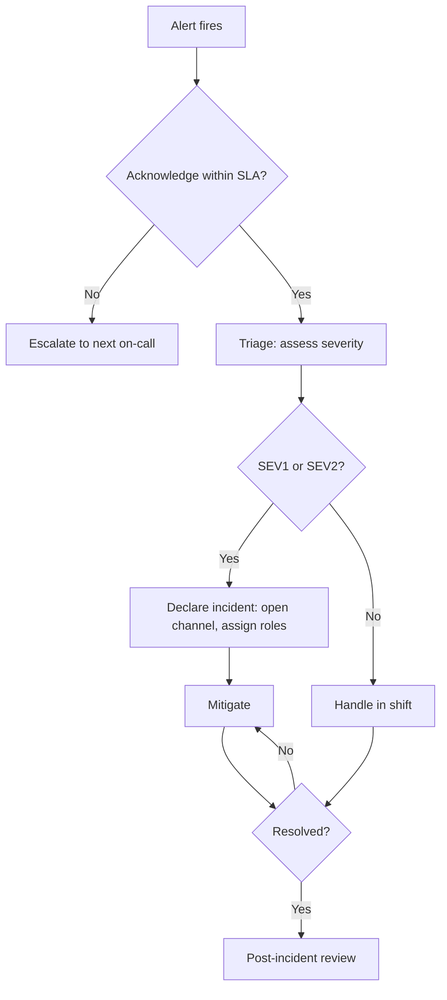

# STRIKE GEN AI — Incident Response

Version: 0.1

Date: 2026-07-09

Author: STRIKE GEN AI SRE Team

---

## 1. Overview

This document defines the incident response process: roles, severity levels, communication, and post-incident review. It is a planning-stage document; the operational steps for specific incidents live in the [Operations Runbook](operations-runbook.md).

See also:
- [Operations Runbook](operations-runbook.md) — common incident procedures.
- [Observability](observability.md) — alerting and dashboards.
- [Security Architecture](security-architecture.md) — breach-specific controls.

---

## 2. Severity Levels

| Severity | Impact | Response | Examples |
|---|---|---|---|
| SEV1 | Critical: platform down or data loss | Page on-call immediately; declare incident | Auth down, payments failing, all generation failing |
| SEV2 | Major: significant feature degraded | Page on-call; incident declared if not quick fix | Single provider down, billing webhook backlog, queue backlog growing |
| SEV3 | Minor: limited impact or workaround | Alert on-call (chat); handle in shift | Elevated errors for one route, slow but working |
| SEV4 | Low: cosmetic or non-user-facing | Ticket; no immediate response | UI glitch on a non-critical page, internal dashboard lag |

---

## 3. Roles

- **Incident Commander (IC):** coordinates response, makes go/no-go decisions, owns the timeline. Does not fix issues directly.
- **Operations Lead:** executes mitigations and investigation.
- **Communications Lead:** writes status updates and user comms.
- **Scribe:** records timeline, decisions, and actions in the incident channel.
- **Subject Matter Experts (SMEs):** pulled in as needed (e.g., payments expert, provider integration owner).

For SEV3/SEV4, one person may hold multiple roles. SEV1/SEV2 require an explicit IC distinct from the operator fixing the issue.

---

## 4. Response Flow

---

## 5. Acknowledgement SLAs

| Severity | Ack Target | Resolution Target |
|---|---|---|
| SEV1 | 5 min | 1 hour (mitigation) |
| SEV2 | 15 min | 4 hours |
| SEV3 | 1 hour | Next business day |
| SEV4 | Next shift | Next sprint |

Targets are planning-stage and refined against the [Service Level Agreement](service-level-agreement.md).

---

## 6. Communication

### Internal
- Incident channel created on declaration: `#inc-<id>-<short-desc>`.
- IC posts a standing update every 30 minutes (SEV1) or hourly (SEV2) until resolved.
- Executives are notified on SEV1 declaration and on SEV2 that exceeds 2 hours.

### External
- Status page updated on SEV1/SEV2 declaration and on resolution.
- User-facing messaging is honest, jargon-free, and avoids speculation about root cause before the review.
- Post-resolution, a public summary is published for SEV1/SEV2 within 5 business days.

---

## 7. Mitigation Principles

- **Stabilize before diagnosing.** Roll back, disable features, or scale out to restore service, then investigate.
- **Prefer reversible actions.** Feature flag off, roll back deployment, drain a provider. Avoid destructive actions.
- **Communicate before big actions.** If a mitigation affects users (e.g., disabling generation), the IC confirms with stakeholders before executing.
- **Do not fix forward in an incident.** A patch in the heat of an incident is high risk; mitigate and fix properly afterward.

---

## 8. Escalation

- If the primary on-call cannot acknowledge within the ack SLA, the alert escalates to the secondary on-call, then to the team lead.
- Anyone may escalate by paging the IC role directly if they believe a situation is being under-treated.
- Escalation to external parties (security vendor, cloud provider support, payment processor support) is authorized by the IC.

---

## 9. Security Incidents

For suspected security incidents (breach, credential leak, abuse):
- Treat as SEV1 until proven otherwise.
- Engage the security lead immediately; they join as an SME and may take the IC role.
- Preserve evidence: do not delete logs or rotate keys until evidence is captured, unless rotation is the mitigation itself.
- Follow the [Security Architecture](security-architecture.md) breach playbook for customer notification and regulatory obligations.

---

## 10. Post-Incident Review

For every SEV1/SEV2:
- Hold a blameless review within 5 business days.
- Produce a written report: timeline, impact, root cause, contributing factors, what went well, what did not, action items with owners and due dates.
- Action items are tracked to completion; the IC owns follow-up until items are closed or transferred.

Blameless principle: the review focuses on systems and processes, not individuals. People behave sensibly given the information and incentives they have; fix the system.

---

## 11. Tabletop Exercises

- Run a tabletop exercise quarterly against a plausible scenario (provider outage, payment processor incident, data leak).
- Exercises validate runbook accuracy, alerting, and role readiness.
- Gaps found in exercises are tracked as action items.

---

## Revision History

- 0.1 — Initial incident response (2026-07-09)
