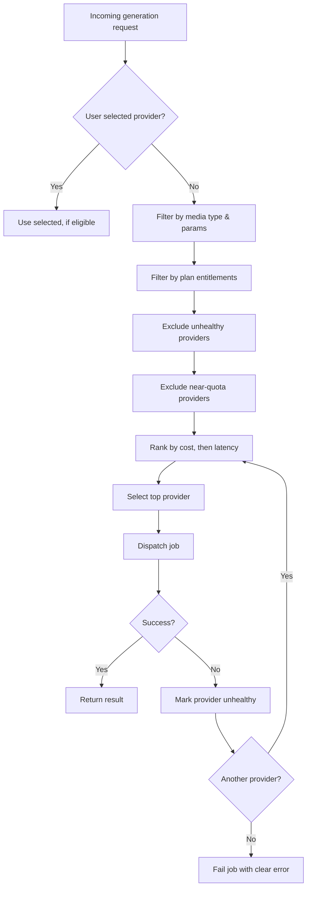

# STRIKE GEN AI — Model Routing

Version: 0.1

Date: 2026-07-09

Author: STRIKE GEN AI Architecture Team

---

## 1. Overview

Model routing determines which AI provider handles a given generation request. The routing layer sits between the orchestration API and the provider adapters, abstracting provider selection from callers. This is a planning-stage document defining the routing policy and decision inputs.

See also:
- [System Architecture](system-architecture.md) — AI Generation Engine.
- [AI Pricing & Credit System](ai-pricing-and-credit-system.md) — cost-aware routing.
- [Feature Flags](feature-flags.md) — provider rollout controls.

---

## 2. Goals

- **Cost optimization** — prefer the cheapest provider that meets quality and latency SLAs.
- **Availability** — fail over across providers on outages or rate limits.
- **Quality** — route to higher-quality providers for premium tiers or sensitive jobs.
- **User preference** — allow explicit provider selection where supported.
- **Load distribution** — spread load to avoid hitting any single provider's quota.

---

## 3. Routing Inputs

The router considers, in priority order:

1. **User-selected provider** — if the user explicitly chooses a provider, honor it (when entitled).
2. **Media type and parameters** — only providers that support the requested media type, resolution, and duration are candidates.
3. **Plan tier** — premium tiers may access higher-quality or faster providers.
4. **Cost estimate** — among eligible providers, prefer the lowest estimated credit cost.
5. **Provider health** — exclude providers in a degraded state (circuit breaker open).
6. **Current load / quota** — exclude providers near their rate limit; prefer providers with spare capacity.
7. **Latency SLA** — for priority-queue jobs, prefer providers meeting the latency target.

---

## 4. Decision Flow

---

## 5. Provider Health

Each provider tracks:
- Recent success rate (rolling window).
- Recent p95 latency.
- Circuit breaker state: `closed` (healthy), `open` (failing fast), `half-open` (probe).

Rules:
- Open the breaker after N consecutive failures or a success rate below threshold.
- Half-open after a cooldown; send a probe request.
- Close on probe success; re-open on probe failure.

Health state is shared across workers (in-memory with short TTL is acceptable at MVP; a shared store is introduced at scale).

---

## 6. Failover

- On provider error, timeout, or rate-limit response, the router selects the next-best provider and retries.
- Retries use exponential backoff with jitter.
- Maximum retry count is bounded (default 2 failover attempts) to limit cost and latency.
- The final failure is surfaced to the user with a clear message and a retry option; the user is not charged for a fully failed job (see [AI Pricing & Credit System](ai-pricing-and-credit-system.md)).

---

## 7. Cost-Aware Routing

- Each provider adapter exposes a cost estimator for a given request shape.
- The router normalizes cost to credits and ranks candidates by ascending cost.
- Ties break on latency SLA, then on current load.

---

## 8. User Preference

- Users on paid plans may pin a provider when supported (e.g., for consistency across a project).
- Pinned selection is ignored if the provider is unhealthy or ineligible for the request parameters; the router falls back to automatic selection and notifies the user.

---

## 9. Observability

Routing decisions are logged with:
- Request ID, job ID, user ID, selected provider, candidate set, selection reason.
- Failover events with the failed provider and error class.
- Provider health transitions.

See [Observability](observability.md) for metrics and alerting.

---

## 10. Future Considerations

- **Quality scoring** — feed generation quality metrics back into routing decisions.
- **A/B routing** — split traffic across providers to benchmark quality and cost.
- **Capacity reservations** — pre-negotiated capacity with providers for guaranteed throughput.
- **Regional routing** — route to providers with data residency matching user requirements.

---

## Revision History

- 0.1 — Initial model routing (2026-07-09)
