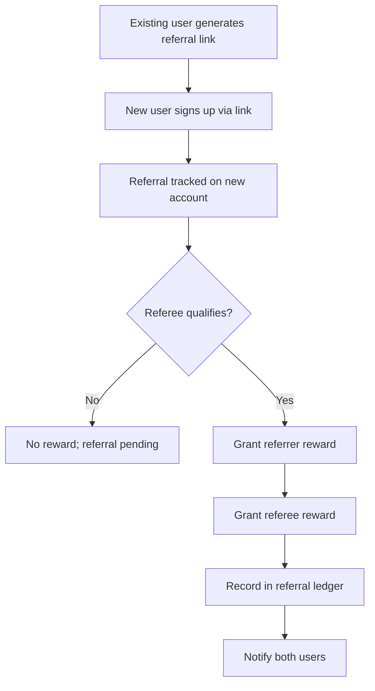

# STRIKE GEN AI — Referral System

Version: 0.1

Date: 2026-07-09

Author: STRIKE GEN AI Growth Team

---

## 1. Overview

The referral system rewards existing users for inviting new users to STRIKE GEN AI. This document defines eligibility, rewards, fraud controls, and tracking. It is a planning-stage document; reward amounts are illustrative.

See also:
- [Business Model](business-model.md) §12 — acquisition channels.
- [Credit Top-Up System](credit-topup-system.md) — credit grants as rewards.
- [Subscription Plans](subscription-plans.md) — plan gating.

---

## 2. Goals

- Drive qualified new user acquisition through existing users.
- Reward referrals only when the invitee becomes a paying user (quality over volume).
- Prevent abuse and self-referral.

---

## 3. Eligibility

- **Referrer:** Must have an active account in good standing. Free-tier users may refer; rewards differ by referrer plan.
- **Referee:** Must be a new user who has never created an account. The referral is tracked via the invite link or invite code at signup.
- **Qualifying event:** The referee must activate a paid subscription or make a credit purchase. Signup alone does not trigger the reward.

---

## 4. Rewards

| Referrer plan | Referrer reward | Referee reward |
|---|---|---|
| Free | 20 credits | 10 credits |
| Creator | 50 credits | 15 credits |
| Pro | 100 credits | 20 credits |
| Enterprise | Custom | Custom |

- Rewards are granted as promotional credits with a 90-day expiry.
- Rewards are recorded in `credit_transactions` with `reason = promo` and a reference to the referral record.
- Both rewards trigger on the qualifying event, not at signup.

---

## 5. Referral Flow

---

## 6. Tracking

- Each referral link encodes the referrer's user ID.
- On signup, the referral is recorded with `referrer_id`, `referee_id`, `status = pending`.
- On the qualifying event, `status` transitions to `completed` and rewards are granted.
- Referrals expire after 90 days without a qualifying event (`status = expired`).

---

## 7. Fraud Controls

- Self-referral is blocked (same user, same payment method, same device fingerprint).
- A referrer cannot earn more than N rewards per month (default 50) without manual review.
- Referees must complete the qualifying event with a real payment; refunded or chargebacked events claw back the reward.
- Suspicious clusters (many referees from one IP) are flagged for review.

---

## 8. Limits

- Referral credits are promotional and expire (unlike purchased credits).
- Referral rewards do not count toward the referrer's plan's included credits.
- We may pause or adjust the program with 30 days' notice.

---

## 9. Dashboard

- Users see their referral link, pending and completed referrals, and total credits earned.
- Admins see aggregate referral metrics and a fraud review queue.
- Referral metrics are part of [Analytics & Reporting](analytics-and-reporting.md).

---

## 10. Future Considerations

- **Tiered rewards** — larger rewards for referees who reach higher plans.
- **Referral leaderboards** with periodic bonuses.
- **Team referrals** — organization-to-organization invitations.

---

## Revision History

- 0.1 — Initial referral system (2026-07-09)
