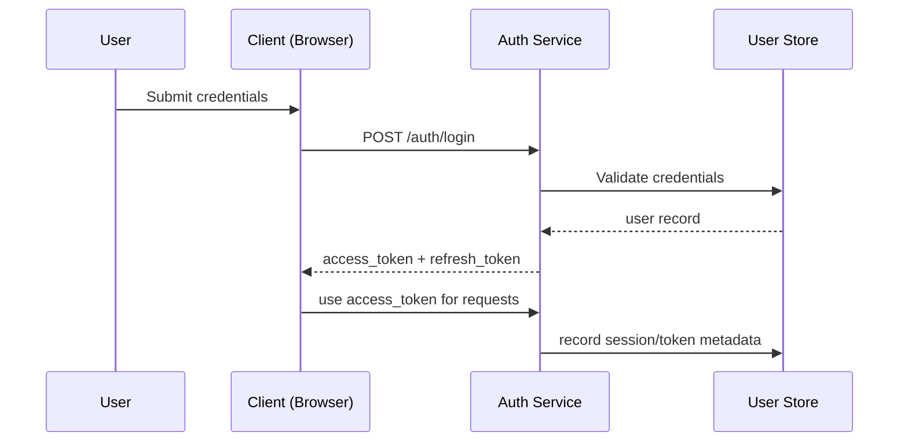
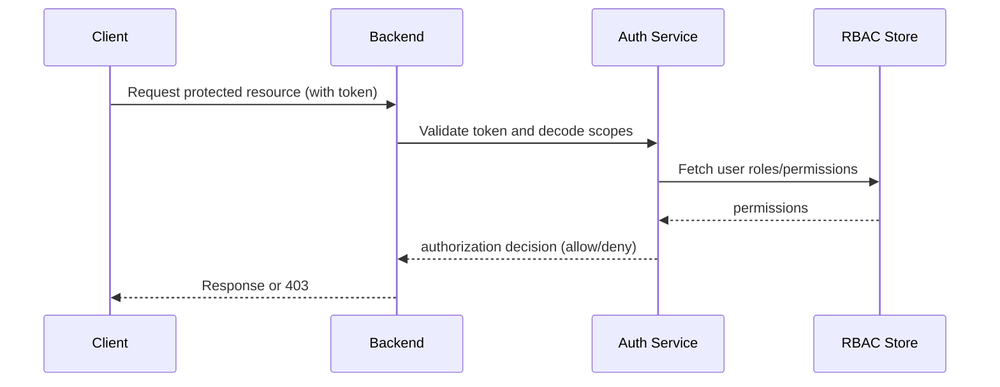
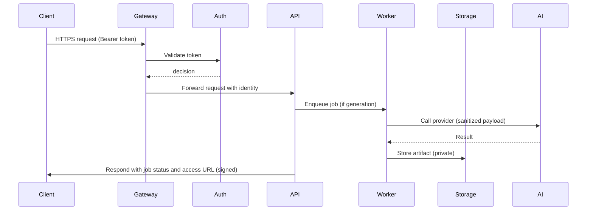

# STRIKE GEN AI — Security Architecture (Planning Document)

Version: 0.1

Date: 2026-07-09

Author: STRIKE GEN AI Security Team

---

This planning-stage Security Architecture document defines the security posture, principles, threat model, and recommended controls for STRIKE GEN AI. It is technology-agnostic and focuses on design, policies, and best practices suitable for future implementation. It intentionally excludes implementation code and vendor-specific configurations.

---

## 1. Security Overview

Purpose: Provide a structured security model for STRIKE GEN AI that protects user data, media assets, billing information, and system integrity while enabling safe AI generation capabilities.

Scope:
- User-facing web application and APIs
- Backend orchestration, worker processes, and integrations with AI and payment providers
- Asset storage and content delivery
- Administrative and operational interfaces

Security goals:
- Confidentiality: Protect sensitive data and secrets.
- Integrity: Prevent unauthorized modification of data and transactions.
- Availability: Ensure critical services remain available under reasonable load and during incidents.
- Accountability: Provide audit trails and traceability for security-relevant actions.

---

## 2. Security Principles

- Defense in depth: Multiple layers of controls (network, application, data, identity).
- Least privilege: Grant minimum access required for users and services.
- Fail secure: Default-deny access; fail safely under error conditions.
- Secure by design: Integrate security into architecture and development lifecycle.
- Separation of duties: Distinguish operational, administrative, and financial privileges.
- Principle of least trust: Treat external data and integrations as untrusted.
- Privacy by design: Minimize collection of PII and enable user control over data.

---

## 3. Threat Model

Primary threat categories:
- Unauthorized access (credential theft, account takeover, compromised admin keys)
- Data exfiltration (leak of PII, billing data, generated media)
- Abuse of generation capabilities (spam, disallowed content, mass usage to exhaust credits)
- Supply chain and third-party risk (compromised AI or payment providers)
- Fraud and billing attacks (chargebacks, fake payments)
- Denial of Service (targeted or volumetric attacks against APIs or AI providers)
- Insider threats (malicious or accidental data exposure by staff)

Assets to protect:
- User credentials and identity tokens
- Payment and billing records
- Credit ledger and transactions
- Generated media assets and project metadata
- Audit logs and admin actions

Attack surfaces:
- Public APIs and authentication endpoints
- File upload endpoints and asset delivery
- Webhooks and provider callbacks
- Admin dashboards and management APIs

Risk mitigations are documented throughout this architecture.

---

## 4. Authentication Strategy

Objectives:
- Strong authentication for users and administrators.
- Support for session revocation and token rotation.
- Extensible for multi-factor authentication (MFA) and SSO in the future.

Planned controls:
- Primary authentication via secure, token-based mechanism (short-lived access tokens + refresh tokens).
- Enforce strong password policies (length, complexity, breach detection) at account creation.
- Email verification for account activation.
- Support for MFA as a configurable option (TOTP, SMS or authenticator apps) for high-privilege accounts.
- Admin and service accounts require stronger controls (short token lifetimes, scoped service tokens).

Mermaid — Authentication Flow

Notes:
- Tokens must be revocable and monitored for misuse.
- Refresh tokens stored securely; refresh flows validated for device/context.

---

## 5. Authorization (RBAC)

Principles:
- Role-based access control (RBAC) with clearly defined roles and scopes: user, admin, finance, support, system.
- Fine-grained resource scoping: resource ownership enforced at API layer.
- Least-privilege default for API keys and service tokens.

Planned role capabilities (examples):
- user: manage own projects, assets, and billing; submit generation jobs.
- admin: manage users, moderate content, adjust credits, view system metrics.
- finance: process refunds, view payment reports.
- support: view user activity, assist with account issues (no billing authorization by default).

Mermaid — Authorization Flow

Notes:
- Policy enforcement point is at API gateway / backend API layer.
- Consider attribute-based access controls (ABAC) when team/org features are introduced.

---

## 6. Identity Management

Key capabilities:
- Centralized user identity store with separation of authentication (credentials) and profile data.
- Support for federated identity (SSO) in future via standard protocols (OAuth2/OIDC, SAML) while preserving RBAC mapping.
- Lifecycle management: provisioning, deprovisioning, role changes, and automated cleanup for inactive accounts.
- Administrative accounts need approval flows and periodic access reviews.

Identity lifecycle policies:
- Account creation requires email verification.
- Dormant accounts flagged after policy-defined inactivity period and subject to re-verification.
- Admin accounts require periodic revalidation and MFA enforcement.

---

## 7. Session Management

Requirements:
- Short-lived access tokens for API calls; refresh tokens for session continuation.
- Revoke tokens on password change, logout, or detected compromise.
- Device and session metadata recorded for session management and anomaly detection (IP, device fingerprint, last used).
- Protect against common session attacks (CSRF for browser forms, session fixation).

Controls:
- Implement session revocation endpoint and admin controls to invalidate sessions for a user.
- Optionally provide users with session management UI to view and revoke active sessions.

---

## 8. API Security

Controls and recommendations:
- Enforce TLS (HTTPS) for all endpoints; HSTS for web clients.
- Validate and sanitize all inputs; apply strict JSON schemas for request bodies.
- Use authentication and authorization middleware to centralize policy enforcement.
- Implement per-endpoint rate limiting, quotas per plan, and burst protections.
- Throttle and require additional verification for high-cost generation endpoints.
- Require idempotency keys for payment and generation creation endpoints to handle retries safely.
- Protect webhooks: validate signatures, allowlist provider IPs when feasible, and implement replay protection.

API Gateway considerations:
- Centralize TLS termination, WAF rules, authentication checks, and rate limiting at the gateway.
- Emit audit events for privileged API calls and failed authorization attempts.

---

## 9. Data Protection

Data classification:
- Public: Marketing pages, public user profile fields when opted-in.
- Internal: Non-sensitive metadata and aggregated metrics.
- Sensitive: Email addresses, billing metadata, credit balances, provider responses.
- Restricted: Payment tokens, password hashes, secrets.

Controls:
- Encrypt sensitive and restricted data at rest.
- Minimize retention of PII and limit access via RBAC and least privilege.
- Store raw provider responses with access restrictions and optional redaction.
- Implement data masking for logs and UIs where appropriate (e.g., obfuscating card fragments).

---

## 10. Encryption Strategy

Principles:
- Enforce TLS for all network traffic.
- Encrypt sensitive data at rest (disk, snapshots) and backups.
- Use strong ciphers and keep cryptographic libraries up to date.

Key management:
- Do not hard-code keys; use a secure key management service (KMS) or vault.
- Rotate encryption keys periodically and support key rotation without data loss.
- Encrypt backup artifacts and restrict access to backup stores.

---

## 11. Secrets Management

Requirements:
- Centralize secrets in a secrets management solution.
- Rotate secrets regularly and on suspected compromise.
- Avoid storing secrets in source control, logs, or in application configuration files plaintext.

Operational controls:
- Audit all access to secrets and maintain an access ledger for privileged reads.
- Use short-lived service credentials when possible and issue scoped tokens for service-to-service calls.

---

## 12. Payment Security

Key objectives:
- Do not store raw card data unless absolutely required for business and compliant with PCI-DSS.
- Use tokenized payment methods via certified payment providers.
- Implement strong reconciliation and audit trails for payments, invoices, and refunds.

Controls:
- Validate webhook signatures from payment providers and reconcile events regularly.
- Limit administrative refund actions to finance role and require justification and audit logging.
- Detect anomalous payment behavior via fraud detection heuristics and manual review flows.

---

## 13. AI Provider Security

Risks:
- Sensitive prompts or generated content may be transmitted to third-party AI providers.
- Provider outages or compromised provider leading to data leakage.

Controls:
- Classify which data is safe to send to providers; sanitize or redact PII in prompts where required by policy.
- Use adapter abstraction to support multiple providers and to route sensitive jobs to trusted providers or on-premise options in the future.
- Contractual and operational controls: ensure providers have appropriate security certifications and SLAs.
- Audit provider interactions and log minimal provider request/response metadata.

---

## 14. File Upload Security

Threats:
- Malicious files (malware, scripts) and object storage misuse.
- Large or malformed files to exhaust resources.

Controls:
- Validate file types and content-type headers; use content inspection to verify media types.
- Limit upload size and enforce quotas per user/plan.
- Use virus/malware scanning for uploaded files and generated outputs before making them available.
- Store uploads in segregated buckets/containers with least-privilege access.
- Generate signed, time-limited URLs for asset access; avoid serving assets directly from primary storage without access checks.

---

## 15. Logging & Audit Trails

Requirements:
- Audit logs for security-relevant and financial events: logins, password resets, admin actions, credit adjustments, refunds, and webhook events.
- Immutable, tamper-evident logging where feasible (append-only storage, log signing).
- Correlate logs using request_id, job_id, and user_id for incident investigations.

Log handling:
- Centralized log aggregation with retention policies and role-based access to logs.
- Mask sensitive fields in logs (PII, card fragments, secrets).
- Export and archive logs needed for compliance and long-term audits.

---

## 16. Monitoring & Incident Response

Monitoring:
- Instrument key security signals: authentication failures, suspicious IPs, unusual generation volumes, rate-limit triggers, payment anomalies.
- Health checks for external integrations and AI providers.
- Dashboard alerts for high-severity events and threshold-based triggers.

Incident response:
- Establish an incident response plan with clear roles, escalation paths, and communication templates.
- Run periodic tabletop exercises and post-incident reviews.
- Prepare containment strategies: token revocation, provider isolation, service throttles.

---

## 17. Backup & Disaster Recovery

Requirements:
- Regular backups of critical relational data (users, billing, credits, metadata) with encrypted storage.
- Asset storage backups or replication strategies for media.
- Define Recovery Time Objective (RTO) and Recovery Point Objective (RPO) aligned with business needs.
- Maintain documented recovery runbooks and test restore procedures regularly.

Security considerations:
- Protect backups using same or stronger access controls; encrypt backups and audit access.

---

## 18. Compliance & Privacy

Consider regulatory requirements (planning-stage):
- Data protection regulations (e.g., GDPR, CCPA) for user data rights and breach notification.
- Financial record retention requirements for billing and payments.
- Evaluate provider compliance (e.g., SOC2, ISO 27001) when selecting partners.

Privacy controls:
- Provide mechanisms for data export and delete (subject to legal retention needs).
- Implement data minimization and purpose-limitation policies.

---

## 19. Security Testing Strategy

Planned testing activities:
- Static Application Security Testing (SAST) during CI for code-level issues.
- Dynamic Application Security Testing (DAST) against deployed environments (staging) to find runtime issues.
- Regular dependency vulnerability scanning and patch management.
- Periodic penetration testing by qualified third parties.
- Red team exercises for threat emulation once baseline maturity is achieved.
- Automated fuzzing and input validation tests for API endpoints and file upload handlers.

Pre-release checks:
- Security checklist gate for releases that includes secrets scanning, SAST findings triage, and dependency updates.

---

## 20. Future Security Enhancements

Roadmap items for improved security posture:
- Hardened secrets management with short-lived service certificates and workload identity.
- Adaptive authentication and risk-based MFA triggers.
- Customer-configurable data residency controls and regional isolation for enterprise customers.
- Integration with enterprise SIEM and SOAR for automated detection and response.
- Content-based policy enforcement using ML-assisted moderation for generated content.
- Formal threat modeling cadence and continuous privacy impact assessments.

Mermaid — Secure Request Lifecycle

---

Revision History

- 0.1 — Initial Security Architecture (2026-07-09)
