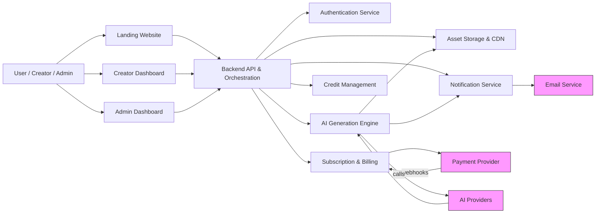
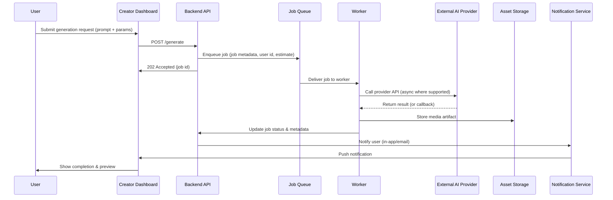
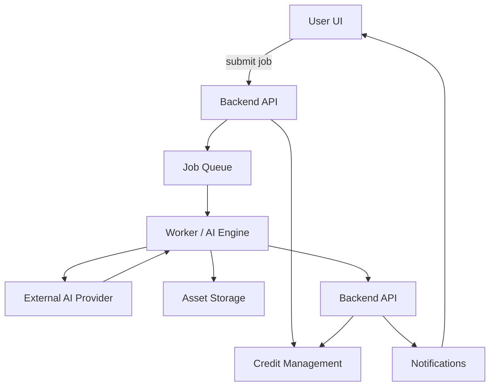
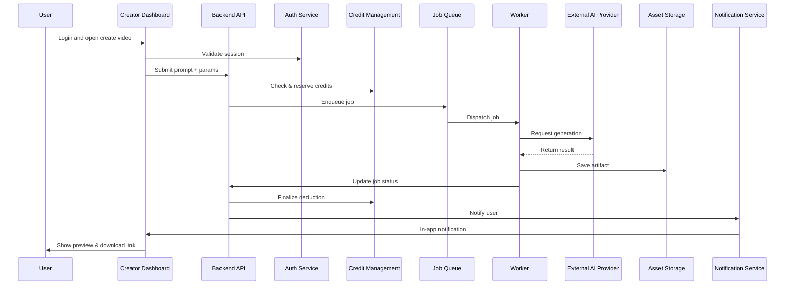

# STRIKE GEN AI — System Architecture (Planning Stage)

Version: 0.1

Date: 2026-07-09

Author: STRIKE GEN AI Architecture Team

---

## 1. Architecture Overview

This document describes the planned system architecture for STRIKE GEN AI. It is a planning-stage architecture document that focuses on high-level components, responsibilities, interactions, data flow, and non-prescriptive design decisions. The goal is to provide a clear conceptual model that guides subsequent design, specification, and implementation phases.

Key objectives:
- Present a modular, maintainable, and scalable architecture for an AI-powered content creation platform.
- Define component responsibilities and their interactions with external services.
- Illustrate typical user and system workflows, including media generation and billing.

---

## 2. Design Principles

- Separation of concerns: Components have clear responsibility boundaries.
- Modularity and replaceability: External integrations are accessed via adapters so providers can be swapped.
- Security by design: Least privilege, encrypting sensitive data, and auditing are core requirements.
- Resilience and graceful degradation: The system should degrade non-critical features when dependencies fail.
- Observability: Components expose metrics, logs, and traces for monitoring and troubleshooting.
- Technology-agnostic: The architecture avoids prescribing frameworks, languages, or cloud providers.

---

## 3. High-Level System Architecture

The system is composed of front-end surfaces (public landing site, creator dashboard, admin dashboard), a backend orchestration layer, worker services for AI generation, persistent storage, and external integrations for AI providers, payments, and email.

Mermaid — System Context Diagram

---

## 4. Major Components

Each major component is described with its responsibilities, inputs/outputs, and key interactions.

### 4.1 Landing Website

Purpose: Public-facing pages for marketing, documentation, plan comparison, and account registration.

Responsibilities:
- Present product information and pricing.
- Provide sign-up and sign-in entry points that redirect to the creator dashboard.
- Serve static content and marketing assets.

Interactions:
- Calls Backend API for registration and discovery endpoints.
- Links to Billing service for plan purchase flow.

### 4.2 Authentication Service

Purpose: Centralized identity and access management for users and administrators.

Responsibilities:
- User registration and email verification.
- Secure credential storage and session management.
- Token issuance and validation for API access.
- Role-based access control (RBAC) for admin and support roles.

Inputs/Outputs:
- Inputs: registration requests, login credentials, token validation requests.
- Outputs: tokens, session metadata, user profiles.

Interactions:
- Integrates with email service for verification and password reset.
- Integrates with backend API for authorization checks.

### 4.3 Creator Dashboard

Purpose: Primary user interface for creating prompts, managing projects, and accessing assets.

Responsibilities:
- Provide tooling for submitting generation requests (video, image, audio).
- Display credit balances, generation history, and project lists.
- Offer previews, downloads, and project management features.

Interactions:
- Communicates with Backend API for job submission, status, and asset retrieval.
- Receives notifications (in-app) for job completion.

### 4.4 AI Generation Engine

Purpose: Orchestrates requests to AI providers and manages media generation pipelines.

Responsibilities:
- Accept generation jobs, validate parameters, and estimate cost in credits.
- Enqueue jobs and dispatch to worker pools.
- Use adapters to invoke external AI provider APIs and handle asynchronous results.
- Post-process results (transcoding, thumbnailing, upscaling) when needed.
- Store generated artifacts in Asset Storage and record metadata.

Key considerations:
- Job queuing with retry and backoff strategies.
- Idempotency and job tracing for debugging and audit.

Mermaid — AI Generation Workflow

### 4.5 Credit Management

Purpose: Manage credit balances, deductions, allocations, and history.

Responsibilities:
- Maintain accurate credit ledger per user or subscription.
- Reserve or deduct credits when generation jobs are accepted.
- Reconcile credit usage with job completion (adjust for actual cost vs estimate).
- Support administrative adjustments (manual allocation, refunds).

Interactions:
- Exposes APIs to Backend for querying and changing balances.
- Integrates with Billing for credit purchases and subscription allocations.

### 4.6 Subscription & Billing

Purpose: Manage plan definitions, subscription lifecycle, invoicing, and payment reconciliation.

Responsibilities:
- Define plans, entitlements, and renewal schedules.
- Trigger credit allocations on renewals.
- Initiate charges and handle payment webhooks.
- Provide billing history and invoice generation for users and finance staff.

Interactions:
- Integrates with Payment Provider for checkout and recurring billing.
- Notifies users and the Admin Dashboard about billing events.

### 4.7 Project Management

Purpose: Organize user-generated assets into projects and collections.

Responsibilities:
- CRUD operations for projects and folders.
- Tagging, searching, and filtering assets.
- Enforce retention and access controls.

Interactions:
- Uses Asset Storage for file references and thumbnails.
- Backend API provides index/search capabilities.

### 4.8 Asset Storage

Purpose: Durable storage and delivery of generated media assets.

Responsibilities:
- Store original and derived media (thumbnails, transcoded versions).
- Serve assets via CDN or optimized delivery.
- Implement lifecycle and archival policies to control costs.

Considerations:
- Metadata indexing for efficient search and retrieval.
- Access control rules to prevent unauthorized downloads.

### 4.9 Notification Service

Purpose: Deliver timely notifications (in-app, email, and optional webhook callbacks).

Responsibilities:
- Send transactional emails (verification, billing receipts).
- Deliver in-app notifications and push messages.
- Queue and retry delivery of notifications.

Interactions:
- Receives events from Backend and AI Engine.
- Uses Email Services and optional push providers.

### 4.10 Admin Dashboard

Purpose: Operational interface for platform administrators and support staff.

Responsibilities:
- User and subscription management (search, role assignment, deactivation).
- Analytics and reporting (usage, revenue, generation volume).
- Content moderation tools and audit logs.
- Billing operations (refunds, manual credit adjustments).

Interactions:
- Backend APIs with privileged endpoints; RBAC enforced by Authentication Service.

---

## 5. External Integrations

The platform relies on external services through well-defined integration adapters. Adapters should encapsulate provider-specific logic and expose a consistent internal interface.

### 5.1 AI Providers

Role: Supply media generation capabilities (video, image, audio) through APIs or SDKs.

Design notes:
- Multiple providers may be used to balance cost, quality, and availability.
- Adapters manage authentication, rate limiting, retries, and cost estimation heuristics.

### 5.2 Payment Providers

Role: Handle monetary transactions, subscription billing, and refunds.

Design notes:
- Provider integration should support webhook-driven event reconciliation.
- Sensitive payment data should not be stored directly unless required for compliance.

### 5.3 Email Services

Role: Send transactional and marketing emails.

Design notes:
- Use an email provider with deliverability features and templates.
- Support for dedicated sending domains and bounce handling.

---

## 6. Data Flow

At a high level, the data flow follows these steps:
1. User interaction: submission of generation requests or billing actions via UI.
2. Backend validation: the API validates inputs, estimates cost, and checks credit balance.
3. Job enqueuing: validated jobs are enqueued with metadata and reserved credits.
4. Worker execution: workers call AI providers, handle callbacks, post-process, and store results.
5. Storage and indexing: artifacts are stored and metadata indexed for retrieval.
6. Notification and reconciliation: users notified and credit ledger reconciled to final cost.

Mermaid — High-Level Data Flow

---

## 7. User Request Flow

This section documents a typical user flow for creating a video asset.

Mermaid — User Request Flow

---

## 8. Security Architecture

Security goals:
- Protect user data and assets.
- Prevent unauthorized access to generation and billing operations.
- Detect and respond to abuse and policy violations.

Controls and design elements:
- Authentication and RBAC: Centralized auth service issues short-lived tokens and enforces RBAC for admin APIs.
- Encryption: Data-in-transit must be encrypted; sensitive data stored encrypted at rest.
- Input validation: All user-supplied inputs are validated and sanitized before use or forwarding to external providers.
- Rate limiting: Apply per-user and per-IP limits on generation endpoints to prevent abuse.
- Audit logging: Record security-relevant events, admin actions, and billing changes for audit and forensics.
- Content moderation: Implement automated detection (where possible) and manual review workflows for policy violations.
- Secrets management: Provider credentials and keys are handled securely via a secrets vault (implementation detail deferred).

---

## 9. Scalability Strategy

The architecture supports scalable growth through:
- Horizontal scaling: Stateless frontends and orchestration services can scale horizontally behind load balancers.
- Workers: Worker fleets for AI generation scale independently according to job queue depth and provider throughput.
- Partitioning: Data partitioning by tenant or sharding strategies for metadata stores to scale read/write throughput.
- Asynchronous processing: Job queue decouples request handling from generation execution, smoothing load spikes.
- Storage tiering: Use tiered storage and lifecycle policies to manage cost for large media volumes.

Capacity planning considerations:
- Monitor queue depth, job latency, and provider limits to scale workers proactively.
- Implement autoscaling policies based on business metrics (active users, generation rate).

---

## 10. Reliability & Fault Tolerance

Design patterns for reliability:
- Durable queues with persistence for job metadata and retries.
- Retry and exponential backoff for transient failures with idempotent job execution semantics.
- Circuit breakers around external integrations to fail fast and avoid cascading failures.
- Graceful degradation: When AI providers are degraded, surface clear messaging and offer queuing or alternative providers.
- Health checks and automatic restart policies for worker processes.
- Backup and restore: Regular backups of critical metadata and billing information with tested restore procedures.

---

## 11. Monitoring & Logging

Observability strategy:
- Metrics: Expose key metrics (request rates, generation durations, queue sizes, errors, credit transactions) to monitoring systems.
- Distributed tracing: Propagate trace context across API calls, workers, and external provider interactions to support root-cause analysis.
- Centralized logging: Aggregate structured logs with correlation identifiers (request id, job id, user id) for search and alerting.
- Alerts: Define alerting thresholds for system health (queue backlog, error rates, payment failures, storage exhaustion).
- Dashboards: Operational dashboards for SRE and product metrics for product and executive stakeholders.

---

## 12. Future Architecture Evolution

Planned evolutionary directions:
- Multi-provider orchestration: Dynamic routing to AI providers by cost/quality SLAs and user preference.
- Edge delivery: Improved asset delivery via regional caches or edge functions for lower latency.
- Teams and Organizations: Extend multi-tenant data partitioning and access controls to support organization-level collaboration.
- External API: Provide rate-limited external API for partners and advanced integrations.
- On-prem or hybrid options: For enterprise customers with specific data residency or compliance requirements.

---

Revision History

- 0.1 — Initial planning-stage architecture (2026-07-09)
