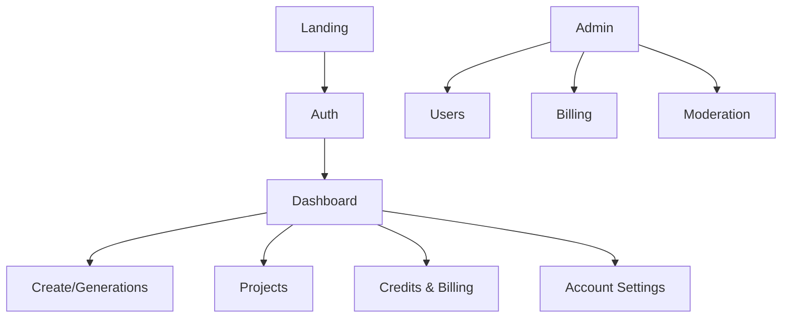

# STRIKE GEN AI — UI / UX Design System (Planning Document)

Version: 0.1

Date: 2026-07-09

Author: STRIKE GEN AI Design Team

---

This planning-stage UI/UX Design System documents visual language, component guidelines, accessibility considerations, and layout patterns for STRIKE GEN AI. It is technology-agnostic and intended to guide product design, handoff, and future implementation by development teams.

---

1. Design Philosophy

- Human-centered: Prioritize user goals, clarity, and speed in content creation workflows.
- Minimal friction: Streamline common tasks (prompting, previewing, saving) to reduce cognitive load.
- Delightful interactions: Use motion and feedback to make complex processes feel responsive and understandable.
- Trust & transparency: Make costs, credits, and system status visible and predictable.

2. Design Principles

- Clarity: Present only necessary information; use progressive disclosure for advanced options.
- Consistency: Reuse components, tokens, and layouts across the product.
- Accessibility: Design for inclusivity (WCAG 2.1 AA baseline) across all components.
- Efficiency: Enable power users with keyboard shortcuts and repeatable templates.
- Scalability: Components must support single-user and enterprise multi-team contexts.

3. Brand Identity

- Tone: Professional, creative, approachable.
- Voice: Helpful, concise, and encouraging.
- Logo: Primary horizontal logo (wordmark + mark), with stacked and simplified icons for compact contexts.
- Imagery: Use real creator examples, minimal abstract art for marketing; generated asset previews for the product.

Brand usage guidance: preserve clear space around logo, do not distort or recolor beyond approved palette.

4. Color System

Purpose: Accessible, scalable color palette with semantic roles.

Primary palette:
- Primary (Brand): strong accent used for primary actions and highlights.
- Secondary: complementary accent for secondary actions and accents.

Neutral palette:
- Surface (backgrounds): light and dark variants
- Border / Divider
- Text colors: primary, secondary, muted

Semantic colors:
- Success (for success states)
- Warning (for cautions)
- Danger (for errors)
- Info (for system notices)

Accessibility rules:
- Minimum contrast ratios: 4.5:1 for body text, 3:1 for large text.
- Provide high-contrast variants and ensure color is not the only conveyed meaning (use icons/text labels).

5. Typography

- Primary typeface: Modern, humanist sans-serif for UI (choose in implementation phase).
- Scale: Define tokenized font sizes and weights for H1..H6, body, small, caption.
- Line height and spacing tokens to improve readability in content-heavy interfaces (dashboards, docs).

Typographic rules:
- Use clear hierarchy and consistent spacing for section headings and content.
- Avoid all-caps for body; reserve small-caps or uppercase for compact labels sparingly.

6. Spacing & Layout

- Token-based spacing scale (e.g., 4px base): 4, 8, 16, 24, 32, 48, 64.
- Use spacing tokens for margins, paddings, and component gaps to maintain rhythm.

7. Grid System

- Base grid: 12-column responsive grid for desktop, collapsing to 4/6 columns on tablet and a single column on mobile.
- Gutters and margins follow spacing tokens and scale responsively.
- Breakpoints: mobile (≤600px), tablet (601–1024px), desktop (≥1025px) — implementation-phase may refine.

8. Iconography

- Visual style: geometric, consistent stroke weight, simple forms.
- Use icons to support meaning, not replace labels.
- Provide filled and outline variants for different states.
- Include accessible labels (aria-label) and focusable interactive icons.

9. Buttons

Variants:
- Primary: filled, for main CTA.
- Secondary: outlined or lower-emphasis for secondary actions.
- Ghost: minimal for inline actions.
- Danger: for destructive actions (delete, irreversible ops).
- Icon-only: compact actions with accessible labels.

States: default, hover, active, disabled, loading — all must have visible differences and meet contrast.

Sizing: small / regular / large variants mapped to touch targets (minimum 44x44px recommended).

10. Form Components

Core elements:
- Text inputs, textareas, selects, multi-selects, toggle switches, radio groups, checkboxes, date/time pickers, file upload.

Validation and feedback:
- Inline validation: show contextual error messages and accessible focus management.
- Success/neutral/info messages: use semantic colors and concise guidance.

Accessibility:
- Proper label association, aria-describedby for helper text, keyboard navigation, and focus indicators.

11. Cards

Purpose: Present assets, project summaries, generation results in a contained surface.

Variants:
- Asset card: thumbnail, title, metadata (type, duration, size), quick actions (download, share, delete).
- Project card: title, description, last updated, project actions.
- Compact and expanded card states for list vs detail contexts.

Design rules:
- Use consistent elevation and border radii.
- Provide hover state with contextual actions.

12. Navigation

- Top-level navigation: primary sections (Dashboard, Create, Projects, Credits, Billing, Admin [if role]).
- Use clear labels and supporting icons.
- Secondary navigation: context-aware sub-navigation within sections (e.g., Generations → Videos/Images/Audio).
- Breadcrumbs: for deep navigation within projects and assets.

13. Sidebar

- Collapsible sidebar for primary navigation on desktop; bottom navigation or hamburger menu on mobile.
- Include user account summary, quick actions, and plan/credit balance snapshot.
- Support pinned items (favorites) for fast access.

14. Dashboard Layout

- Top: summary row with credit balance, quick actions, and important notices.
- Middle: recent projects, recent generations, usage charts (small multiples).
- Bottom: resource list and suggested templates.
- Responsive: stack summary then lists on small screens; use card grid on larger screens.

15. AI Generator Interface

Main goals: Minimize friction while exposing useful controls.

Layout:
- Left pane: prompt input and quick templates.
- Center canvas: preview area and history of attempts (versions).
- Right pane: generation settings (style, duration, aspect ratio, resolution), cost estimate, and credits confirmation.
- Bottom: generation history with thumbnails and quick actions.

Interaction patterns:
- Progressive disclosure for advanced options.
- Cost estimation visible and explicit before committing.
- Show live progress with meaningful status updates and cancel option.

16. Project Management Interface

- Project list with search and filters.
- Project detail page: project metadata, assets gallery, generation history, collaborator settings (future).
- Bulk actions: select multiple assets to move, tag, download, or delete.

17. Tables

- Use tables for ledger views (credits, transactions), payments, and audit logs.
- Support column resizing, sorting, filtering, and pagination (cursor-based preferred for large datasets).
- Provide export options (CSV/JSON) where meaningful.

Accessibility:
- Proper table semantics, keyboard navigation, and screen reader-friendly labels.

18. Modals & Dialogs

- Use modals for confirmation, small workflows, or focused tasks (e.g., rename project, confirm delete).
- Ensure focus trap and keyboard accessibility (ESC to close, first focusable element focus on open).
- Dialogs must present clear actions: primary vs secondary and destructive styles for irreversible actions.

19. Notifications & Toasts

- In-app toasts for ephemeral confirmations (copied to clipboard, save success) at top-right or top-center.
- Persistent notifications for billing or important platform announcements in a notifications center.
- Email notifications for out-of-band events (generation complete, billing issues) with preferences.

20. Loading States

- Use skeletons for lists and cards to communicate loading structure.
- Use spinners and inline progress for actions with duration (video generation progress bar, percent complete).
- Provide cancellations where appropriate and prevent duplicate submissions with disabled state.

21. Empty States

- Provide helpful guidance and call-to-action for empty lists (create project, upload assets, try a template).
- Use illustrative graphics and concise instructions.

22. Error States

- Show human-readable error messages and clear remediation steps (retry, contact support).
- For generation failures, preserve inputs and provide re-run options.
- Use error boundaries to prevent entire UI from crashing.

23. Accessibility Guidelines

- Aim for WCAG 2.1 AA: color contrast, keyboard operability, semantic HTML structures, and screen reader compatibility.
- Focus management: move focus to modals, error summaries, and newly rendered content.
- Provide skip links for keyboard users to skip navigation.
- Use ARIA where native semantics are insufficient; prefer native elements.
- Test with screen readers and keyboard-only interaction flows.

24. Responsive Design Strategy

- Mobile-first approach: prioritize content and actions relevant to small screens.
- Collapse secondary controls into progressive panels and accordions on narrow viewports.
- Ensure touch targets meet minimum sizes and gestures are discoverable.

25. Motion & Animation Principles

- Motion should be purposeful: guide attention, communicate hierarchy, and provide feedback.
- Prefer reduced-motion preferences: respect user OS-level reduced motion settings.
- Use subtle easing and short durations (100–300ms) for micro-interactions; longer for large transitions.

26. Dark Mode

- Provide a complete dark theme with inverted surface colors and adjusted semantic colors for readability.
- Ensure color tokens for semantic states are distinct and meet contrast requirements in dark mode.
- Respect system preferences and allow manual toggle.

27. Design Tokens

- Define tokens for colors, typography, spacing, radii, elevations, and motion durations.
- Tokens should be source-of-truth and exported into implementation artifacts when ready.

Example token categories:
- color.primary, color.surface, color.text.primary, spacing.xs..xl, font.size.base, radius.md

28. Future Design Evolution

- Support teams & roles: extend patterns for organization and collaborator flows.
- Template marketplace: components for listings, previews, and ratings.
- Design system theming support for white-labeling or enterprise branding.
- Expand component library with advanced data visualization components and interactive editing tools.

Component Inventory

- Atoms: buttons, inputs, icons, labels, avatars, badges, tooltips
- Molecules: form rows, input groups, card headers, media thumbnails
- Organisms: navigation, sidebar, dashboard summary, generation form
- Templates: project page, generation result page, admin user list

Naming Conventions

- Use BEM-like semantic naming for components (ComponentName + Variant): e.g., Button--primary, Card--compact, Input--error.
- Token names use dot notation and semantic roles: color.primary, spacing.md.
- Accessibility: prefix interactive elements with role where necessary in documentation (e.g., Button[primary]).

UI Consistency Guidelines

- Reuse tokens and components; avoid visual exceptions unless justified.
- Keep microcopy concise and action-oriented (verbs first for buttons: "Generate", "Download").
- Avoid overloading the interface with simultaneous modals or toasts.
- Use consistent iconography and labeling across similar actions.

Example Page Hierarchy

- Home / Landing
- Sign up / Sign in / Onboarding
- Dashboard
  - Create / Generations
    - Create Video
    - Create Image
    - Create Audio
  - Projects
    - Project Detail
      - Assets Gallery
      - Generation History
  - Credits & Billing
  - Notifications
  - Account Settings
- Admin (role-based)
  - Users
  - Billing & Refunds
  - Moderation

Mermaid — Sitemap

---

Revision History

- 0.1 — Initial UI/UX design system (2026-07-09)
