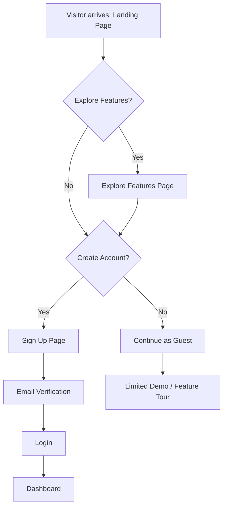
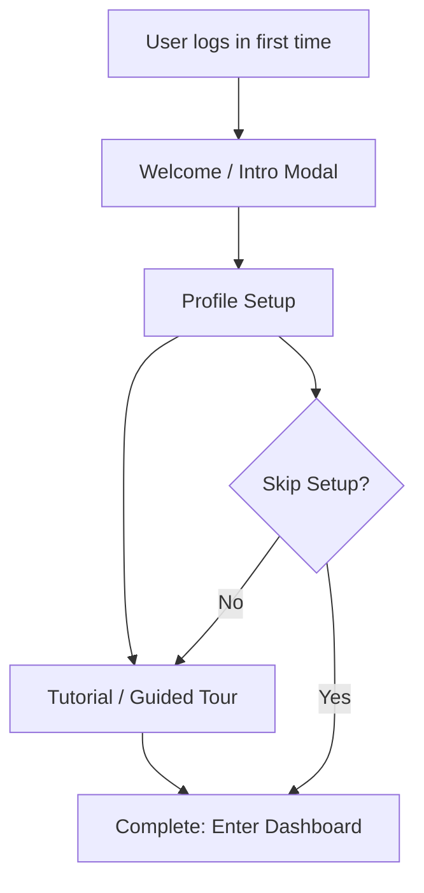
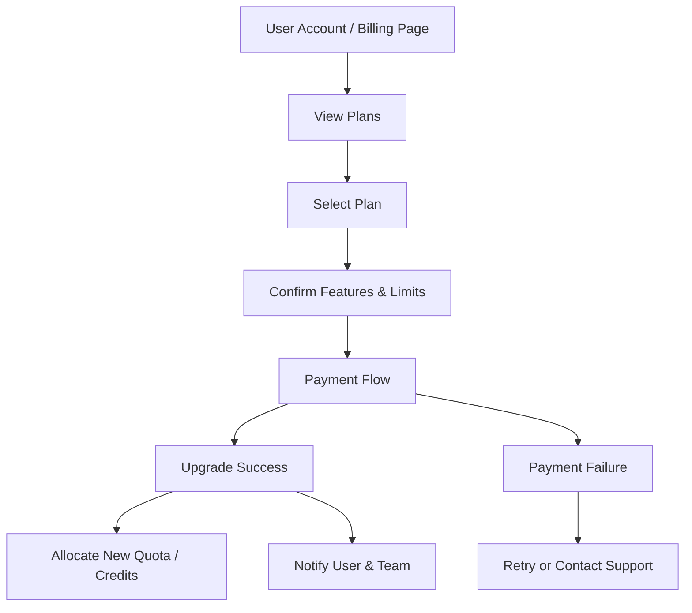
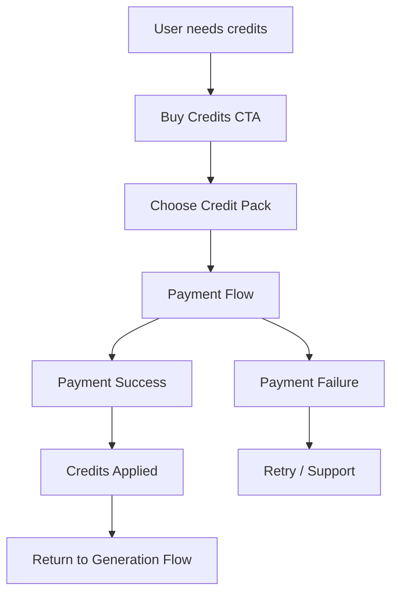
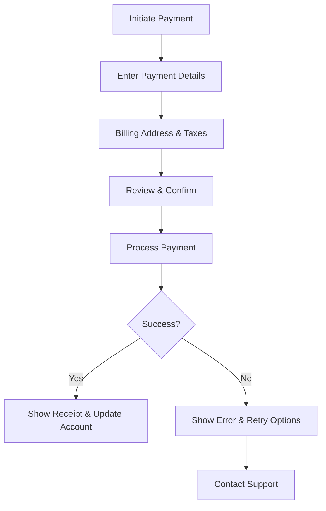
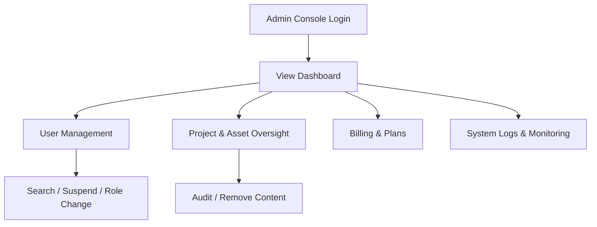
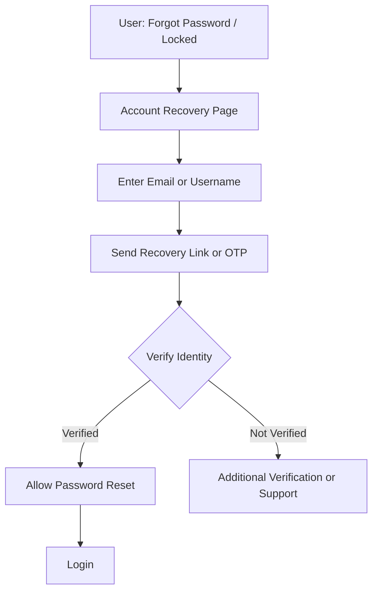
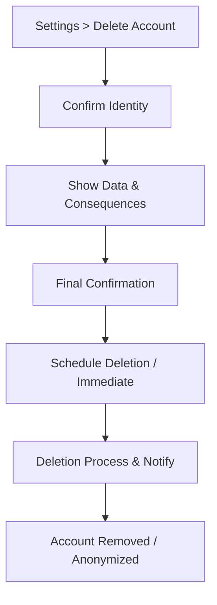
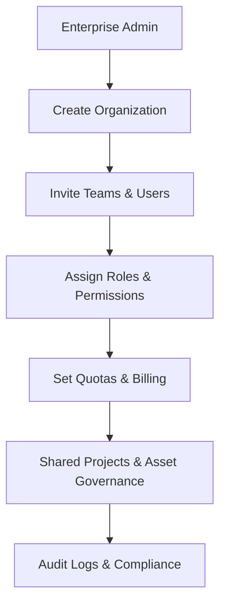

# User Flows — STRIKE GEN AI

This is a planning-stage UX document describing primary user flows for STRIKE GEN AI. Each flow contains a Mermaid flowchart and a written description focusing on user experience and interaction design. Implementation details are intentionally omitted.

---

## 1. Visitor Journey



Goal: Provide a clear path from discovery to conversion (sign up) while allowing guests to explore the product.

Entry point: Public landing page, marketing links, social, search.

Main success path:
- Visitor lands on page → explores features → signs up → verifies email → logs in → reaches dashboard.

Alternative paths:
- Visitor skips sign up and uses limited demo/feature tour.
- Visitor decides to sign up directly from a CTA elsewhere and is routed to Sign Up.

Error paths:
- Email verification email not received → offer resend, alternative verification (SMS), or support contact.
- Sign-up failure due to validation errors → show inline validation and tips.

Exit conditions:
- User reaches Dashboard (success) or leaves site (bounce). 

---

## 2. New User Onboarding



Goal: Get new users to a meaningful “Aha!” moment quickly by setting up minimal profile info and showing key features.

Entry point: First login after sign up, or email invite link.

Main success path:
- Welcome → profile setup (name, organization, preferences) → brief interactive tutorial demonstrating core flows → user arrives at personalized dashboard.

Alternative paths:
- User skips profile setup or tutorial and enters the dashboard.
- User completes setup in multiple sessions (save-in-progress).

Error paths:
- Profile save failure → show retry, offline notice, or save locally until connection restored.
- Tutorial step fails to load → fallback to static help page.

Exit conditions:
- User reaches Dashboard or explicitly skips onboarding.

---

## 3. AI Video Generation Flow

```mermaid
flowchart TD
  A[Dashboard / Create Video CTA] --> B[Prompt Input]
  B --> C[Model Selection]
  C --> D[Settings (resolution, length, style)]
  D --> E[Credit Check]
  E -- Enough Credits --> F[Generate Video]
  E -- Not Enough --> G[Offer Purchase / Trial Credits]
  F --> H[Generation (processing screen)]
  H --> I[Preview]
  I --> J{Save or Re-generate?}
  J -- Save --> K[Save to Project]
  J -- Re-generate --> B
  K --> L[Download]
```

Goal: Enable users to generate high-quality videos from text prompts, preview results, and save or download final assets.

Entry point: Dashboard Create CTA, project page, or template.

Main success path:
- User provides prompt → selects model and settings → system checks credits → generation runs → preview shown → user saves and downloads.

Alternative paths:
- User chooses model presets or templates.
- User accepts auto-suggested prompt refinements.
- User edits generated video (trim, captions) before final save (if supported later).

Error paths:
- Credit shortfall → show clear call-to-action to purchase credits or apply free trial.
- Generation failure (server/timeouts) → show error with suggested retry and contact support; optionally provide partial outputs or logs.
- Invalid prompt → validation and helpful suggestions.

Exit conditions:
- Video saved to project and/or downloaded; user returns to dashboard or initiates another generation.

---

## 4. AI Image Generation Flow

```mermaid
flowchart TD
  A[Dashboard / Create Image CTA] --> B[Prompt Input]
  B --> C[Model / Style Selection]
  C --> D[Settings (size, aspect, iterations)]
  D --> E[Credit Check]
  E -- Enough --> F[Generate Image]
  E -- Not Enough --> G[Prompt Purchase]
  F --> H[Preview & Variations]
  H --> I{Select / Edit}
  I -- Select --> J[Save to Project]
  I -- Edit --> K[Edit Settings / Re-generate]
  J --> L[Download / Export]
```

Goal: Let users produce images from text prompts with style controls and iteration to refine results.

Entry point: Dashboard, templates, or inline UI inside project.

Main success path:
- Enter prompt → choose style/model → adjust size/aspect → confirm credits → generate → refine variants → save/download.

Alternative paths:
- Use image-to-image or upload a reference image (future capability) to influence output.
- Use presets for common styles (photorealistic, illustration).

Error paths:
- Model rate limit or content policy rejection → explain cause and offer alternatives.
- Broken generation or corrupted output → allow retry or fallback to lower-fidelity render.

Exit conditions:
- Image saved and/or downloaded; user can start new generation or continue in project.

---

## 5. AI Audio Generation Flow

```mermaid
flowchart TD
  A[Dashboard / Create Audio CTA] --> B[Prompt or Script Input]
  B --> C[Voice & Model Selection]
  C --> D[Settings (tempo, length, format)]
  D --> E[Credit Check]
  E -- Enough --> F[Generate Audio]
  E -- Not Enough --> G[Purchase Credits]
  F --> H[Processing / Transcoding]
  H --> I[Preview / Listen]
  I --> J{Accept or Re-generate}
  J -- Accept --> K[Save to Project]
  J -- Re-generate --> B
  K --> L[Download / Export]
```

Goal: Produce high-fidelity AI-generated audio from text or prompts with voice selection and export options.

Entry point: Dashboard, content editor, or project page.

Main success path:
- User provides script/prompt → picks voice → configures settings → credits verified → generation → listens → saves/exports.

Alternative paths:
- Generate short clips vs episodes (template-driven).
- Add background music or soundscape (future enhancement).

Error paths:
- Licensing/voice restrictions → warn user and offer alternatives.
- Generation quality issues → offer adjustments (speed, pitch) and re-generate.

Exit conditions:
- Audio asset saved and/or downloaded; user back to project or dashboard.

---

## 6. Project Management Flow

```mermaid
flowchart TD
  A[Dashboard] --> B[Create Project]
  B --> C[Project Settings (name, team, visibility)]
  C --> D[Project Workspace]
  D --> E[Create Asset (video/image/audio)]
  D --> F[Invite Collaborators]
  F --> G[Set Roles & Permissions]
  E --> H[Save Asset to Project]
  H --> I[Asset Library]
  I --> J[Export / Share]
```

Goal: Organize generated assets into projects with collaboration features and clear lifecycle for assets.

Entry point: Dashboard > Projects or global Create button.

Main success path:
- Create project → configure basic settings → create and save assets → invite collaborators → manage and export assets.

Alternative paths:
- Create project from template or import existing assets.
- Mark project private/public or archive project.

Error paths:
- Team invite emails fail → show resend and manual invite link.
- Permission update conflicts → warn and suggest refresh.

Exit conditions:
- Project created and assets organized; user returns to dashboard or shares project.

---

## 7. Subscription Upgrade Flow



Goal: Allow users to upgrade subscription with clear benefits and minimal friction.

Entry point: Account > Billing, feature-restricted CTA (e.g., try pro feature), or pricing page.

Main success path:
- User views plans → selects plan → confirms billing → payment succeeds → account upgraded and quotas applied.

Alternative paths:
- Applying promo codes or trial periods.
- Team-admin initiates upgrade for organization.

Error paths:
- Payment decline → show clear reason, retry option, and alternative payment methods.
- Downgrade consequences clarified (prorated refunds, feature loss warnings).

Exit conditions:
- Subscription upgraded (success) or user cancels/aborts (no change).

---

## 8. Credit Purchase Flow



Goal: Let users buy credits quickly to continue generating assets.

Entry point: Credit check dialogs in generative flows, billing page, or main CTA.

Main success path:
- Select pack → complete payment → credits applied → resume generation.

Alternative paths:
- Apply coupon or invoice billing for enterprises.
- Auto-top-up option on/off.

Error paths:
- Payment processing errors → retry, alternative method, or contact support.

Exit conditions:
- Credits successfully added or purchase aborted.

---

## 9. Payment Flow



Goal: Secure, clear payment experience with receipts and billing history.

Entry point: Subscription upgrade, credit purchase, enterprise invoice setup.

Main success path:
- Enter details → review → payment success → receipt and billing history updated.

Alternative paths:
- Pay by card, digital wallet, bank transfer (enterprise), or invoice.

Error paths:
- Card declined → show reason when available and guide to fix.
- 3D Secure / authentication failures → guide through additional steps.

Exit conditions:
- Payment confirmed or user abandons payment process.

---

## 10. Notification Flow

```mermaid
flowchart TD
  A[System event] --> B[Evaluate Notification Rules]
  B --> C[Compose Notification]
  C --> D[Delivery Channels (email, in-app, sms)]
  D --> E[Delivery Attempt]
  E --> F{Delivered?}
  F -- Yes --> G[Mark as Sent & Log]
  F -- No --> H[Retry Strategy or Alternative Channel]
  G --> I[User Sees Notification]
```

Goal: Ensure users receive timely, relevant notifications with user control over preferences.

Entry point: Any system events—billing, generation complete, invites, admin alerts.

Main success path:
- Event triggers → notification composed → delivered via user-preferred channel → user informed.

Alternative paths:
- Batch notifications or digest mode (daily/weekly).
- Users opt-in/opt-out for categories.

Error paths:
- Email bounce → fallback to in-app notification and surface to account support.
- Rate limits → degrade to digest or throttle.

Exit conditions:
- Notification delivered or logged as failed and queued for retry.

---

## 11. Admin Management Flow



Goal: Provide admins with oversight tools for users, projects, billing, and system health.

Entry point: Admin console / restricted access area.

Main success path:
- Admin logs in → reviews dashboard → performs actions (suspend user, reset credits, audit logs).

Alternative paths:
- Admin receives alerts and drills down into affected accounts.
- Delegated admin roles for teams.

Error paths:
- Action conflict (race conditions) → show conflict resolution and require confirmation.
- Insufficient privileges → show escalation path.

Exit conditions:
- Admin finishes tasks and logs out; changes applied.

---

## 12. Error & Recovery Flows

```mermaid
flowchart TD
  A[User Action] --> B{Error Occurs?}
  B -- No --> C[Continue]
  B -- Yes --> D[Show Contextual Error Message]
  D --> E[Provide Recovery Options (retry, fallback, contact support)]
  E --> F{User Chooses}
  F -- Retry --> G[Retry Action]
  F -- Use Fallback --> H[Fallback Path]
  F -- Contact Support --> I[Open Support Ticket]
```

Goal: Provide clear, actionable error messages and safe recovery paths to maintain trust.

Entry point: Any user action that can fail (network, processing, payment, policy).

Main success path:
- Detect error → show clear message & context → present recovery options → user recovers and continues.

Alternative paths:
- Automatic retries for transient issues.
- Queue requests for later processing (offline-first behavior).

Error paths:
- Unrecoverable errors → provide clear next steps: support contact, export data, or save locally.

Exit conditions:
- User recovers or escalates to support.

---

## 13. Account Recovery Flow



Goal: Safely restore user access while protecting account security.

Entry point: Login page ("Forgot password"), account lock notices, or support request.

Main success path:
- User requests recovery → receives secure link/OTP → verifies → resets password → logs in.

Alternative paths:
- Multi-factor verification (SMS, authenticator app, security questions) for higher assurance.
- Account recovery via admin support for locked enterprise accounts.

Error paths:
- Recovery email not delivered → allow resend and alternative verification channels.
- Suspicious activity → require additional verification and possibly manual review.

Exit conditions:
- Account recovered and user logged in, or account locked pending support.

---

## 14. Account Deletion Flow



Goal: Allow users to delete accounts in a transparent, reversible (grace period) way and to comply with data policies.

Entry point: Account settings > delete account.

Main success path:
- User confirms identity → shown consequences (loss of assets, billing) → confirms → deletion scheduled or executed → user notified.

Alternative paths:
- Grace period with possibility to restore.
- Export data option before deletion.

Error paths:
- Deletion blocked by billing disputes or legal holds → inform user and provide next steps.

Exit conditions:
- Account deleted/anonymized or deletion put on hold.

---

## 15. Future Enterprise Team Workflow



Goal: Support enterprise-scale collaboration, governance, billing, and compliance.

Entry point: Enterprise onboarding, sales, or admin console.

Main success path:
- Admin creates org → invites members → configures roles and quotas → teams create projects and share assets → governance and audit logs maintain compliance.

Alternative paths:
- SSO integration, centralized billing, and custom SLAs.
- Dedicated enterprise support and onboarding.

Error paths:
- Permission misconfiguration → provide troubleshooting and role simulation tools.
- Billing/account disputes → escalation workflow to enterprise support.

Exit conditions:
- Enterprise environment configured and teams operational.

---

Notes & UX Principles

- Keep steps minimal: prioritize single-focus screens and in-context help.
- Provide progressive disclosure for advanced settings.
- Ensure all flows surface clear success states and next steps.
- Design for recoverability: autosave, graceful degradation, and helpful error messaging.
- Respect user control over billing and data export.

---

File created as a planning-stage UX document. This focuses on interaction design and user experience; no implementation details are included.
